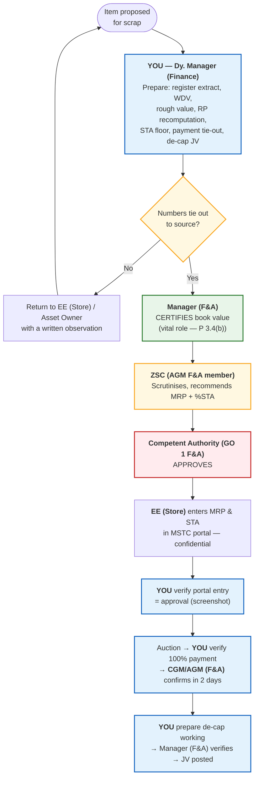

# Deputy Manager (Finance) at the Store
## MSETCL Asset Retirement, Scrap Declaration & Disposal Policy — your responsibilities, your verification points, and the exact desk procedure for each

> **Read this first.** The policy does **not** create a post called "Deputy Manager (Finance)". It names a **Dy. Manager (Store)** who "will be assisting all the activities executed by EE (Store)" **[P 3.4(b)]**, a **Manager (F&A)** in CLARC who is "vital in arriving at the Book Value" **[P 3.4(b)]**, an **AGM (F&A)** in the ZSC **[P 3.1(c)]** and a **CGM/AGM (F&A)** who confirms RTGS receipts **[P 5.0(vii)]**.
>
> **So I am assuming this:** you are the **finance officer sitting at the Major Store who does the ground work** for all of the above. You *prepare, compute, verify and put up*; your **Manager (F&A) / AGM (F&A) certifies**; the **Competent Authority approves**. This document is written for exactly that seat — the person who actually opens the register, pulls the printout, and does the arithmetic.
>
> Every duty is tagged **[P x.x]** = clause of `Policy.pdf`; **[Practice]** = not in the policy, but standard finance discipline you must still follow.
>
> **Related:** [finance-officer-guide.html](finance-officer-guide.html) (the finance head's full manual), [story-guide.html](story-guide.html) (plain-language story), [flowchart.html](flowchart.html) (diagrams).

---

## Part 0 — Your seat in three lines

> **You are the one who makes the numbers defensible.** The Engineer decides *what* is scrap; the Committee decides *that* it is scrap; the Competent Authority decides *at what price* it may go. **You decide whether the numbers on that file can survive an audit two years later.**

### 0.1 The signature ladder — what you may and may not sign

This is the single most important table for you. Signing one line too high is how a Deputy Manager gets into trouble.

| Action | You (Dy. Manager, Finance) | Manager (F&A) | AGM (F&A) — ZSC | Competent Authority |
|---|---|---|---|---|
| Pull register extract, compute WDV | **Prepare & initial** | Certifies | — | — |
| Rough value of an item not in the register | **Prepare the working** | — | Zonal level committee approves **[P 3.4(c)]** | — |
| Consolidated Scrapping List | **Prepare book-value column** | Verify | ZSC grants in-principle approval **[P 3.4(d)]** | — |
| Reserve Price working sheet | **Recompute & countersign** | Countersign | ZSC scrutinises **[P 3.4(g)]** | Approves MRP |
| %STA computation | **Compute** | Verify | ZSC recommends **[P 3.4(g)]** | Approves %STA |
| **Enter MRP & %STA in the MSTC portal** | **You must NOT do this** — it is EE (Store)'s duty, and the figures are confidential **[P 4.7]** | — | — | — |
| Verify portal entry = approval | **Verify & note on file** | — | — | — |
| Verify 100% payment received | **Verify and put up** | — | CGM/AGM (F&A) confirms in writing **[P 5.0(vii)]** | — |
| Generate Delivery Challan / GST Invoice / Gate Pass | **Prepare data; release only after F-4 verification** | — | — | — |
| De-capitalisation working and JV | **Prepare** | Verify | — | Sanction where write-off powers apply |
| Any change in STA% | Flag it | — | **ZSC must approve** **[P 3.4(g)]** | Approves revised |
| Withdrawal of an item after tenders | Flag it | Flag it | Flag it | **Only CA may permit** **[P 4.3]** |

**Rule of thumb:** *You sign "Prepared by". You may sign "Verified by" only where the policy or your office order gives you that authority — otherwise you write "Put up to Manager (F&A) for certification". You never sign "Approved".*

---

## Part 1 — Your twelve responsibilities

| # | Responsibility | Source | Frequency | Output you hand over |
|---|---|---|---|---|
| 1 | **Extract and prepare the book value** of every item proposed for scrap — asset code, gross block, accumulated depreciation, WDV | **[P 3.4(b)]** | Every CLARC cycle | Book value statement → Manager (F&A) |
| 2 | **Flag items not in the Asset Register** and prepare the rough-value working (purchase price estimate − depreciation) | **[P 3.4(c)]** | Every cycle | Rough-value note → Zonal level committee |
| 3 | **Ensure unregistered items are lotted separately** from registered ones | **[P 9.0]** | At lotting | Lot composition note |
| 4 | **Recompute the Reserve Price working** — rate source, date, quantity, arithmetic | **[P 3.4(e)]** | Within the 7-day window | Countersigned RP sheet |
| 5 | **Compute the STA floor** for every lot and check the %STA is within the guided band | **[P 3.4(g), 4.8]** | With each proposal | STA computation sheet |
| 6 | **Verify the MSTC portal entry** of MRP and %STA matches the Competent Authority's approval | **[P 4.7]** | After every entry | Dated screenshot, signed |
| 7 | **Maintain the finance columns of the scrap register** — book value, MRP, H-1, payment, de-cap status | **[Practice]**, supports **[P 9.0]** | Continuously | Scrap register (D-2) |
| 8 | **Verify 100% payment** — three-way tie-out of MSTC advice, bank credit and Sale Order value | **[P 5.0(vii)]** | On every sale | Payment Verification Note (D-3) |
| 9 | **Prepare the Delivery Challan, GST Invoice and Gate Pass data** — release only after the payment check | **[P 5.0(vii)]** | On every sale | Invoice set |
| 10 | **Maintain the Security Deposit ledger** and chase MSTC for refunds | **[P 5.0(iv)]** | Continuously | SD ledger (D-4) |
| 11 | **Prepare the de-capitalisation working** and the journal voucher | **[P 9.0]** | After each lifting | De-cap working (D-5) + JV |
| 12 | **Keep the file audit-ready** and prepare the monthly MIS | **[Practice]** | Monthly | File + MIS (D-6) |

**And one coordination duty the policy states explicitly:** the **Dy. Manager (Store)** assists EE (Store) in all these activities **[P 3.4(b)]**. He is your daily counterpart — every number you verify comes through him. Build that working relationship; it is the difference between a file that moves and a file that stalls.

---

## Part 2 — Your nine verifications, step by step

For each: **what you ask for → what you check → how you do it at your desk → what you write on the file → what you do if it fails.**

### ✅ Verification 1 — Book value (the foundation; everything else depends on it)

| | |
|---|---|
| **Ask for** | The retirement proposal (Proforma-A/-B) + the joint inspection report + the item list from EE (Store) |
| **Check** | Asset code exists; description matches; WDV = Gross block − Accumulated depreciation |
| **How** | 1. Open the asset register / asset accounting system and pull the **individual asset ledger** (never the summary). 2. Match on **asset code**, not description. 3. Recompute WDV in Excel. 4. Check the capitalisation date against the asset's useful life — if fully depreciated, WDV should equal the **residual value**, not necessarily zero. 5. Put a tick and your initials against every line |
| **Write on file** | *"WDV verified from individual ledger page ___; recomputed; found correct. Prepared by ___, dated ___"* |
| **If it fails** | Return to the Asset Owner in writing for the correct asset code. **Never** fill a value "approximately" to keep the file moving |

> **Trap:** an item shown at **nil** book value that is physically present and being sold for lakhs. That is the most common error in scrapping files, and it is your job to catch it, not the Committee's.

### ✅ Verification 2 — Items not in the Asset Register

| | |
|---|---|
| **Ask for** | The item list, and the O&M **weight guidelines** **[P 3.4(c)]** |
| **Check** | Search three ways before declaring "not found": by description, by cost centre, by year of purchase |
| **How** | Build the rough value: **estimated purchase price − depreciation for years held**. Source the purchase price from old work orders / rate contracts / last similar purchase — never from memory |
| **Write on file** | The source of every assumed figure, the committee approval, and the PPE verification reference |
| **If it fails** | Escalate to Manager (F&A). Do not sign a rough value on your own authority — **[P 3.4(c)]** puts it with the Finance Department / Zonal level committee |

### ✅ Verification 3 — Lot composition (the segregation check)

| | |
|---|---|
| **Ask for** | The draft lot list from EE (Store) |
| **Check** | **No lot mixes registered and unregistered items** |
| **How** | Mark every line R (in register) or U (not in register). If a lot contains both, ask for it to be split |
| **Why** | The policy says it directly: if unregistered items make the de-capitalisation figure unascertainable, *"lots shall be suitably made by segregating all such items"* **[P 9.0]** |
| **If it fails** | Written note to EE (Store) with a revised lotting suggestion. This is cheap now and impossible later |

### ✅ Verification 4 — Reserve Price

| | |
|---|---|
| **Ask for** | The RP working sheet + survey report from EE (Store) |
| **Check** | Rate source, **date** of rate, quantity basis, arithmetic, allowances |
| **How** | 1. Open the **MSTC site yourself** and take a dated printout of the metal rate — do not accept a rate quoted over the phone. 2. Confirm it is the **latest** rate or the **last auctioned rate** **[P 3.4(e)]**. 3. Recompute every line: `= qty × rate`. Watch unit mismatches (MT vs kg). 4. Compare the derived ₹/kg with what we **actually realised** in our last three auctions for similar material. 5. Check allowances: contamination, dismantling, remote location, hazardous handling |
| **Write on file** | *"RP recomputed; rate sourced from MSTC printout dated ___; derived rate ₹___/kg vs last three realisations ₹___/___/___. Countersigned ___"* |
| **If it fails** | If the RP is far above our own best realisation, say so in writing — an unrealistic RP guarantees a "no bid" and six months of delay |

### ✅ Verification 5 — STA floor

| | |
|---|---|
| **Check** | `STA floor = MRP − (%STA × MRP)` — i.e. `= MRP × (1 − STA%)` in Excel |
| **How** | Use the policy's own examples to test your formula: RP ₹50,000 with 10% → ₹45,000; RP ₹10,000 with 40% → ₹6,000 **[P 4.8]**. Then check: (a) the % is within the **0%–50%** band normally recommended **[P 4.8]**; (b) **hazardous lots carry a high %** so they sell first time; (c) the **same Competent Authority** who approved the MRP also authorised the %STA **[P 3.4(g)]**; (d) any **revision** of %STA was approved by **ZSC** **[P 3.4(g)]** — note that ZSC may even go to **100% STA** if warranted **[P 6.3]** |
| **If it fails** | Wrong floor = either a genuine buyer rejected or a distress price approved. Put it in writing the same day |

### ✅ Verification 6 — Portal entry (confidentiality and accuracy)

| | |
|---|---|
| **Ask for** | A system printout/screenshot from the MSTC login after EE (Store) has entered the figures |
| **Check** | MRP and %STA in the portal **exactly equal** the Competent Authority's approval letter, lot by lot |
| **How** | Sit with the EE (Store) or Dy. Manager (Store) while the screen is open; take the print; compare line by line; sign and date the print |
| **Write on file** | *"Portal entry verified equal to CA approval no. ___ dated ___. Screenshot at page ___"* |
| **Never** | Never yourself key in MRP/STA. The policy makes it EE (Store)'s job and calls the figures *"a confidential as well as an important matter"* **[P 4.7]**. If you were to key them in, you would lose your independent check — and you would own the leak if one happens |

### ✅ Verification 7 — 100% payment (your highest-risk verification)

| | |
|---|---|
| **Ask for** | Sale/Acceptance Order, Delivery Order, MSTC remittance advice, bank statement of the CGM/AGM (F&A) account |
| **Check** | The **three-way tie-out**: *MSTC advice = bank credit = Sale Order value* |
| **How** | 1. Confirm the **10% EMD** was deposited within **7 days** **[P 5.0(i),(iii)]**. 2. Confirm the **balance** came within **15 days** (Net Sale Value below ₹50 lakh) or **40 days** (₹50 lakh and above) **[P 5.0(iv)]**. 3. Confirm the credit is in the account of the concerned **CGM/AGM (F&A)** **[P 5.0(vii)]**. 4. Check **no deduction** was made — payments are forwarded *"without deduction of their Service Charges"* **[P 5.0(vi)]**. 5. Only then release the Delivery Challan, GST Invoice and Gate Pass |
| **Write on file** | Format **D-3** — one row per figure, each with its source |
| **If it fails** | **Stop.** No challan, no invoice, no gate pass. Escalate immediately to Manager (F&A) — a truck that leaves the gate unpaid is a loss you will be asked to explain |

### ✅ Verification 8 — Delivery, lifting and ground rent

| | |
|---|---|
| **Check** | Lifting within **30 days** of the Delivery Order; delivery only against the **MSTC Photo-ID card** (or a notarised copy with authorisation) **[P 5.0(vi)]**; gate pass and weighment slips match the DO quantity |
| **How** | Diarise the DO date the day it is issued. If delayed, compute ground rent: **1% of material value per week or part thereof, maximum two weeks** **[P 5.0(vi)]** — in Excel: `=MIN(CEILING(days_late/7,1),2) × 1% × material value` |
| **Write on file** | Bill the ground rent, record the recovery, and report it in the MIS |
| **If it fails** | Material leaving without the ID card, or quantity short at the weighbridge — inform EE (Store) in writing the same day and mark the gate pass register |

### ✅ Verification 9 — De-capitalisation

| | |
|---|---|
| **Ask for** | The final weight/lifting statement and the item-wise scrap cost intimation **[P 9.0]** |
| **Check** | Gross block **and** accumulated depreciation both removed (not just the WDV); gain/loss computed; division intimated |
| **How** | `Gain/(loss) = Sale proceeds apportioned to the item − WDV − directly attributable expenses`. Apportion the lump-sum lot proceeds across items on a stated basis (reserve price ratio or weight ratio) and disclose the basis |
| **Write on file** | Format **D-5** + journal voucher, with the apportionment basis written in words |
| **If it fails** | If the de-cap figure cannot be ascertained because unregistered items are mixed in, **say so in writing** — the policy's answer is re-lotting **[P 9.0]**, not estimating |

---

## Part 3 — A full worked example (T-1, end to end)

*All figures illustrative. In the story guide I used a ₹1 lakh book value to keep arithmetic simple; here I use ₹10 lakh, which is more realistic for a 5% residual on a ₹2 crore asset. **The method is the point, not the numbers.***

**Facts:** 25 MVA transformer T-1, capitalised 01.04.1988, gross block **₹2,00,00,000**, useful life 25 years → fully depreciated, residual 5% retained.

### Step 1 — Book value

| Particulars | Amount (₹) | Source |
|---|---|---|
| Gross block | 2,00,00,000 | Asset ledger page 47 |
| Accumulated depreciation | 1,90,00,000 | Depreciation schedule |
| **WDV / book value** | **10,00,000** | Recomputed by me ✔ |

### Step 2 — Reserve Price (from MSTC rates, within 7 days)

| Material | Qty | Rate | Value (₹) |
|---|---|---|---|
| Copper | 2,000 kg | ₹600/kg | 12,00,000 |
| Transformer steel | 8,000 kg | ₹30/kg | 2,40,000 |
| Aluminium | 1,000 kg | ₹150/kg | 1,50,000 |
| Oil | 10,000 L | ₹40/L | 4,00,000 |
| Gross | | | 19,90,000 |
| Less: dismantling, remote location, oil testing | | | (1,90,000) |
| **Reserve Price proposed** | | | **18,00,000** |

*Cross-check: derived rate ≈ ₹905/kg of metal content vs our last three realisations ₹880 / ₹910 / ₹870 per kg → reasonable. ✔*

### Step 3 — STA

| MRP | %STA | Floor = MRP × (1 − STA%) | Approved by |
|---|---|---|---|
| 18,00,000 | 10% | **16,20,000** | Same Competent Authority as MRP ✔ |

### Step 4 — Auction result and payment

| Particulars | Amount (₹) | Check |
|---|---|---|
| H-1 bid (Net Sale Value) | 17,10,000 | Above STA floor (16,20,000), below MRP → **STA** ✔ |
| Applicable GST @18% (HSN 7404 — verify your HSN) | 3,07,800 | Verify HSN and rate — **[Practice]**, HSN required by **[P 4.7]** |
| Total payable by buyer | 20,17,800 | |
| EMD 10% due in 7 days | 1,71,000 | Received on day 5 ✔ |
| Balance due — **15 days** (NSV < ₹50 lakh) | 15,39,000 | Received on day 12 ✔ |
| **Three-way tie-out** | MSTC advice = bank credit = Sale Order value | ✔ F-4/D-3 signed |
| MSTC service charges | Billed separately — **not** deducted from the remittance **[P 5.0(vi)]** | Verify |
| SD retained by MSTC, refundable within 15 days of completion **[P 5.0(iv)]** | 1,71,000 | Entered in SD ledger ✔ |

### Step 5 — De-capitalisation (illustrative entries — post to the heads your CO prescribes)

| Entry | Debit (₹) | Credit (₹) |
|---|---|---|
| **On sale proceeds:** Bank / MSTC receivable A/c — Dr | 17,10,000 | |
|     To Gain on disposal of asset A/c | | 17,10,000 |
| **On de-recognition:** Accumulated Depreciation A/c — Dr | 1,90,00,000 | |
|     Gain on disposal of asset A/c — Dr (WDV) | 10,00,000 | |
|     To Asset (Gross block) A/c | | 2,00,00,000 |
| **GST collected on scrap sale:** Bank A/c — Dr | 3,07,800 | |
|     To GST payable A/c | | 3,07,800 |

**Net result:** gain of **₹7,10,000** (17,10,000 − 10,00,000), less any directly attributable expenses, taken to the P&L **[P 9.0]**. Intimate the division so it writes the equipment off its asset book **[P General Guideline 7]**.

> **Caution:** these entries are illustrative. The policy only requires that the finance department *"de-capitalize the items from the Asset Register and do the proper accounting in P&L"* **[P 9.0]**. Use the chart of accounts, GST treatment and approval route your Corporate Office prescribes.

---

## Part 4 — Documents you must demand from others

You cannot verify what you are not given. Make this your standing "call-for-papers" list.

| From whom | Ask for | Use it for | If they don't give it |
|---|---|---|---|
| **Asset Owner** | Proforma-A/-B, joint inspection report, retirement certificate | Verification 1 | Note to the division with a copy to CLARC convener; item stays out of the lot |
| **EE (Store)** | Consolidated scrapping list, survey report, RP working, catalogue copy, portal screenshot, auction result sheet, Sale Order, Delivery Order | Verifications 3–8 | Written reminder; escalate to Manager (F&A) — a file without the RP working cannot be countersigned |
| **Dy. Manager (Store)** | Weighed receipt, stock register extract, gate pass, weighment slips | Verifications 1, 7, 8 | Visit the store; record the discrepancy in writing |
| **O&M Section** | Weight guidelines for metal **[P 3.4(c)]** | Verification 2, 4 | Reminder citing the clause |
| **MSTC** | SD advice, remittance advice, service charge invoice, auction result | Verifications 7, 10 | Follow up through EE (Store); mark the SD as outstanding in the MIS |
| **Bank / treasury** | Statement and UTR of the CGM/AGM (F&A) account | Verification 7 | Do not release the challan until you have the credit evidence |
| **Finance section, CO** | The **uniform standard guidelines** on RP and STA% **[P 3.4(g)]** | Verifications 4, 5 | Write and ask for them; keep the letter on file — it shows you tried |

---

## Part 5 — Your routine

| When | What you do |
|---|---|
| **Daily** | Check the CGM/AGM (F&A) account for MSTC credits; update the SD ledger; tick off any lifting scheduled today |
| **Within 2 days of a credit** | Prepare the Payment Verification Note; ensure the written RTGS confirmation goes out to EE (Store)/Division **[P 5.0(vii)]** |
| **Weekly** | Payment diary: EMD dues (7 days), balance dues (15 / 40 days), lifting dues (30 days), ground rent cases, SD refunds outstanding |
| **Every CLARC cycle** (half-yearly for A(a), quarterly for A(b), B, C, D) | Book value statement for all items on the agenda **[P 2.3.1]** |
| **Within 7 days of survey** | Countersign the RP working **[P 3.4(e)]** |
| **Within 7 working days of an auction closing** | Ensure MSETCL's decision on STA lots has been posted online **[P 5.0(iii)]** — track the date yourself |
| **Monthly** | Scrap register reconciliation, MIS (D-6), exception report, file completeness check |
| **Quarterly** | ZSC meeting papers; consolidated report to CO R&D; MIS on unsold lots |
| **At every PPE verification** | Fix values for unregistered items **[P 3.4(c)]** |

---

## Part 6 — Protecting yourself

You sign "Prepared by" on files that others approve. That still matters. Six habits:

1. **Never certify what you did not recompute.** If you did not open the ledger, do not sign the book value.
2. **Always write the source and the date** next to every figure: *"from MSTC printout dated 12.09"*, *"from asset ledger p.47"*.
3. **Record dissent in writing.** If the RP looks unrealistic or a portal entry is wrong, write a note on the file and get an acknowledgement. A note you wrote is your protection; a complaint you only spoke is not.
4. **Use "Put up" language.** Where you cannot certify, write *"Put up to Manager (F&A) for certification"* rather than leaving a blank.
5. **Keep your own copy** of the MSTC screenshot, the bank UTR and the payment note — three documents that prove you did your job.
6. **Never key in MRP or %STA.** Verification 6 is yours *because* you are not the one entering them.

---

## Part 7 — Red flags you will be the first to see

| # | What you notice | What it may mean | Your move |
|---|---|---|---|
| 1 | Item shows nil book value but is physically valuable | Fully depreciated asset, or a wrong asset code | Recheck the ledger; check the residual value policy |
| 2 | RP per kg far above our best-ever realisation | Unrealistic pricing → no bid | Written note with the comparison |
| 3 | Bids cluster just above the reserve price | Possible leak of the MRP | Report to Manager (F&A); check the access trail **[P 4.7]** |
| 4 | Portal figure ≠ approval letter | Data-entry error or worse | Stop; written note; get it corrected before bidding |
| 5 | Item present in the catalogue but missing at lifting | Withdrawal without approval **[P 4.3]** | Demand the Competent Authority's approval |
| 6 | Weighment slip quantity < DO quantity | Short delivery | Record it; inform EE (Store); hold the gate pass |
| 7 | Truck at the gate before the credit date | Payment not verified | **Stop the truck.** Escalate immediately |
| 8 | SD not refunded after completion | Money stuck with MSTC | SD ledger; monthly follow-up **[P 5.0(iv)]** |
| 9 | Lifting beyond 30 days with no demand for ground rent | Revenue leakage | Compute and bill 1%/week, max two weeks **[P 5.0(vi)]** |
| 10 | One lot mixing registered and unregistered items | De-capitalisation will be impossible | Ask for re-lotting now **[P 9.0]** |
| 11 | Division still shows the asset after the sale | Intimation not sent | Send the item-wise cost intimation **[P 9.0, General Guideline 7]** |
| 12 | You are asked to sign something "because it is routine" | Pressure to skip verification | Ask for the source document. Routine is not a source |

---

## Part 8 — Escalation matrix

| Situation | First | Then | Never |
|---|---|---|---|
| Book value cannot be tied to the register | Asset Owner (division) | **Manager (F&A)** | Fill an assumed value |
| Rough value needed for an unregistered item | Manager (F&A) for the working | **Zonal level committee** approval **[P 3.4(c)]** | Sign it yourself |
| RP looks unrealistic | EE (Store) | **ZSC** through Manager (F&A) | Stay silent |
| Portal entry wrong | EE (Store) immediately | Manager (F&A) in writing | Correct it yourself in the portal |
| Payment short or not received | Hold the challan | **Manager (F&A) / CGM-AGM (F&A)** the same day | Release material "on trust" |
| STA% needs revision | Note on file | **ZSC** approval **[P 3.4(g)]** | Accept a lower bid on your own |
| Item to be withdrawn after tenders | Note on file | **Competent Authority** **[P 4.3]** | Let it quietly drop out |
| You are pressured to sign | Manager (F&A) | Record your note in writing | Sign and hope |

---

## Part 9 — Mini formats you can start using today

### D-1 — Book Value Statement (your daily bread)

| Sr | Asset code | Description | Capitalised on | Life (yrs) | Gross block | Accum. dep. | **WDV** | In register? | Source (ledger page) | Initials |
|---|---|---|---|---|---|---|---|---|---|---|

### D-2 — Scrap Register (finance columns)

| Date in | RC no. | Item | Asset code | Book value | Lot no. | MRP | %STA | Auction no. | H-1 | Status | Payment received | DO date | Lifted on | De-cap JV no. |
|---|---|---|---|---|---|---|---|---|---|---|---|---|---|---|

### D-3 — Payment Verification Note (one per lot)

| Field | Value | Source document |
|---|---|---|
| H-1 / Net Sale Value | | Auction result sheet |
| GST (HSN ___, rate ___) | | GST working |
| Total payable | | |
| EMD 10% — amount, date (due ___) | | MSTC SD advice |
| Balance — amount, date (15 / 40 days) | | MSTC advice |
| Credited to account of CGM/AGM (F&A) on | | Bank statement / UTR |
| **MSTC advice = bank credit = Sale Order value?** | Yes / No | |
| Service charges deducted? (should be **No**) | | Remittance advice |
| **Challan / GST Invoice / Gate Pass released on** | | Signature, date |

### D-4 — Security Deposit Ledger

| Auction no. | Lot | SD amount | Retained by MSTC on | Due back (15 days of completion) | Received on | Balance outstanding | Ageing |
|---|---|---|---|---|---|---|---|

### D-5 — De-capitalisation Working

| Asset code | Gross block | Accum. dep. | WDV | Sale proceeds apportioned | Basis of apportionment | Direct expenses | **Gain/(loss)** | JV no. | Register updated on |
|---|---|---|---|---|---|---|---|---|---|

### D-6 — Monthly MIS (one page)

Lots auctioned · realised value · **realisation vs MRP %** · unsold lots with reasons · SD outstanding · ground rent billed/recovered · items pending de-capitalisation beyond 30 days · age of scrap lying at the store · files missing documents.

---

## Part 10 — The two-minute briefing for your assistant or the store clerk

> "Four things, every time.
>
> **One — value it.** Before anything is scrapped, I want the asset code and the ledger page. Book value means the original cost minus all the depreciation charged so far. If the item is not in the register, tell me — do not quietly write zero.
>
> **Two — price it.** The reserve price comes from the MSTC website's latest rate, and I want the printout with today's date. I will recompute quantity times rate, and compare it with what we got in our last three auctions. Then I compute the STA floor — the reserve price minus that percentage of it. If that floor is wrong, we either throw away a genuine buyer or we sell too cheap.
>
> **Three — check the portal.** I never key in the reserve price. The store enters it; I take a screenshot and check it matches the approval letter word for word. Those numbers are confidential — they don't go on any WhatsApp group.
>
> **Four — count the money before the truck moves.** No delivery challan, no GST invoice, no gate pass until I have matched three things: MSTC's advice, our bank credit, and the sale order value. All three must be equal. Then the RTGS receipt is confirmed in writing within two days. Then the truck goes out. Then we remove the item from the register.
>
> And one habit: **write the source and date next to every figure you give me.** A number without a source is not a number — it's a guess, and I'm not signing a guess."

---

## Part 11 — Ten questions a Deputy Manager actually asks

**1. "Can I sign the book value certificate myself?"**
Prepare it, initial every line, and put it up to the **Manager (F&A)** — the policy makes that post "vital in arriving at the Book Value" **[P 3.4(b)]**.

**2. "EE (Store) has asked me to enter the MRP in the MSTC portal. Should I?"**
No. It is EE (Store)'s duty and the figures are confidential **[P 4.7]**. You verify, you don't enter — that separation is what makes your check worth anything.

**3. "The item is not in the register. Can I put a rough value?"**
Prepare the working, but the value must come through the Finance Department / Zonal level committee and the PPE verification **[P 3.4(c)]**.

**4. "How do I know if the reserve price is too high?"**
Compute the ₹/kg you are asking for and compare it with your **last three auctions' realised rates**. If you are asking far more than you have ever got, the lot will get no bids.

**5. "The bid is below the reserve price. Do I reject it?"**
Only if it is below the **STA floor**. Between the floor and the RP it goes to STA and the Competent Authority decides — within **7 working days** **[P 5.0(ii),(iii)]**.

**6. "The buyer is pressing for material today and promises payment tomorrow."**
No. Delivery only after receipt of the full sale value including GST **[P 5.0(vi)]**. Escalate immediately rather than argue at the gate.

**7. "How long does the buyer get, in total?"**
EMD 10% in **7 days**; balance in **15 days** below ₹50 lakh, **40 days** at or above **[P 5.0(iv)]**; lifting within **30 days** of the DO, after which ground rent of **1% per week, maximum two weeks** **[P 5.0(vi)]**.

**8. "MSTC deducted its charges from our remittance."**
It should not — remittances come *without deduction of service charges* **[P 5.0(vi)]**. Flag it, and book the charges separately.

**9. "Do I need to track the security deposit?"**
Yes. MSTC retains the 10% SD and refunds it to MSETCL on completion of the contract **[P 5.0(iv)]**. If nobody tracks it, nobody gets it back. That ledger is yours.

**10. "What if I genuinely think the price is wrong but everyone else wants to go ahead?"**
Write your note on the file with the figures and the comparison, and get it acknowledged. You have then done your duty; the decision is not yours to make — and the note is your record that you flagged it.

---

## Part 12 — One-line summary you can pin above your desk

> **Value it from the ledger · price it from the MSTC printout · check the portal against the approval · count the money three ways before the truck moves · then take the asset off the books — and write the source and date beside every number you sign.**
