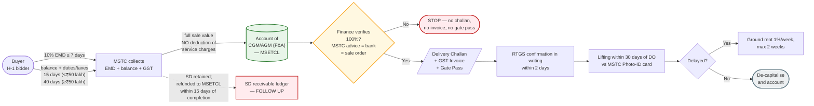

# The Finance Head at the Store
## MSETCL Asset Retirement, Scrap Declaration & Disposal Policy — your responsibilities, what you must verify, and exactly how to verify it

> **How to read this document.** Every duty is tagged with its source: **[P 3.4(b)]** means it comes from that clause of `Policy.pdf`; **[Practice]** means the policy does not say it — it is standard finance hygiene you must still do, and you should confirm it against your own office orders. Where the policy is silent or unclear, I say so plainly.
>
> **Companion documents:** [story-guide.html](story-guide.html) (plain-language story version), [flowchart.html](flowchart.html) (diagram version), and [dy-manager-finance-guide.html](dy-manager-finance-guide.html) — the hands-on desk version for a Deputy Manager (Finance) at the store.

---

## Part 0 — Where your chair actually is

### 0.1 The assumption I have made

You say you are the **finance head at the store**. The policy does not create a post with that name, so here is how I am reading it — correct me if your designation differs, and the rest still holds.

> **Assumption:** you are the **F&A officer posted at or attached to the Major Store / division** (whatever your title: Manager (F&A), Dy. Manager (F&A), AGM (F&A)), and you are the finance counterpart of **EE (Store)** for the entire scrapping chain. Your work is then relied upon by the **AGM (F&A)** who sits in the ZSC, and by the **CGM/AGM (F&A)** in whose account the sale money is credited.

### 0.2 The policy's finance posts, and which ones land on your desk

| Post named in the policy | Where it sits | What the policy gives it | Is it you? |
|---|---|---|---|
| **Manager (F&A) of the Circle** | CLARC member **[P 2.2(iii)]** | "The role of Manager (F&A), a Member of CLARC, will be **vital in arriving at the Book Value** of the asset sold under Scrap" **[P 3.4(b)]** | **Yes** — this is your core valuation duty |
| **Finance Department** | Division / Circle / CO | Decides asset value for items **not in the Asset Register**, during **physical verification of PPE** **[P 3.4(c)]**; de-capitalises items and accounts for them in the P&L **[P 9.0]** | **Yes** — you prepare it and post it |
| **Finance section of Corporate Office** | CO | Issues the **uniform standard guidelines** on Reserve Price and STA% **[P 3.4(g)]** | No — but you implement them and must obtain them |
| **AGM (F&A)** | ZSC member **[P 3.1(c)]** | Scrutinises the proposal; the ZSC's final recommendation of **MRP + %STA** goes to the Competent Authority **[P 3.4(g)]** | Partly — you prepare the working; the AGM (F&A) signs in ZSC |
| **CGM / AGM (F&A)** | Zone / Circle | **Shall confirm receipt of payment through RTGS in writing within two days** to EE (Stores)/Division **[P 5.0(vii)]** | **Yes if this is your post.** If not, your duty is to *obtain* that written confirmation within 2 days and file it |
| **Separate committee (Technical + Finance members)** | To be formed | Finalises the standardised **valuation method for high-value assets** **[P 3.4(c)]** | You will be the finance member or its feeder |

### 0.3 So you wear three hats

| Hat | Name | The question you answer | Policy anchor |
|---|---|---|---|
| 🧮 **Hat 1** | **The Valuator** | "What is this item worth **on our books**, and is that figure right?" | P 3.4(b), 3.4(c), 3.4(d) |
| 🎯 **Hat 2** | **The Price Controller** | "What is the **minimum** we will accept, how much discount is pre-authorised, and is the number entered in the portal the approved number?" | P 3.4(e), 3.4(g), 4.7 |
| 💰 **Hat 3** | **The Receiver & Accountant** | "Did **100% of the money** reach us, is it invoiced and accounted for, and is the asset off our books?" | P 5.0(iv)–(vii), 9.0 |

**Your single-line job description:**

> *Nothing gets retired without a correct book value, nothing goes to auction without an approved Minimum Reserve Price and STA%, nothing leaves the gate without 100% payment verified, and nothing stays on the Asset Register after it is sold.*

```mermaid
flowchart LR
    subgraph H1["🧮 HAT 1 — VALUATOR"]
        A1[/"Proforma-A / -B<br/>+ joint inspection"/] --> A2[("Asset<br/>Register")]
        A2 --> A3{"Book value<br/>correct?"}
        A3 -->|"Not in register"| A4["Rough value working<br/>purchase price − depreciation"]
        A4 --> A5[/"Consolidated Scrapping List<br/>book / depreciated value"/]
        A3 -->|"In register"| A5
    end
    subgraph H2["🎯 HAT 2 — PRICE CONTROLLER"]
        B1[/"Consolidated list"/] --> B2["Survey + Reserve Price<br/>from MSTC rates ≤ 7 days"]
        B2 --> B3["Lots — segregate<br/>registered vs unregistered"]
        B3 --> B4[/"ZSC recommends<br/>MRP + STA%"/]
        B4 --> B5{"Competent Authority<br/>GO 1 (F&amp;A)"}
        B5 --> B6["EE (Store) enters MRP &amp; STA<br/>in MSTC portal — CONFIDENTIAL"]
        B6 --> B7["Verify portal entry<br/>= approved figure"]
    end
    subgraph H3["💰 HAT 3 — RECEIVER &amp; ACCOUNTANT"]
        C1(["Auction closes"]) --> C2{"H-1 vs<br/>RP vs STA"}
        C2 -->|"≥ RP"| C3["Sale Intimation Letter"]
        C2 -->|"in STA band"| C4["Provisional SIL<br/>→ CA decision ≤ 7 working days"]
        C3 --> C5["10% EMD ≤ 7 days<br/>Balance 15 / 40 days"]
        C4 --> C5
        C5 --> C6["Verify 100% credited to<br/>CGM/AGM (F&amp;A) account"]
        C6 --> C7[/"Delivery Challan<br/>+ GST Invoice + Gate Pass"/]
        C7 --> C8["De-capitalise from<br/>Asset Register → P&amp;L"]
    end
    A5 --> B1
    B7 --> C1

    style A3 fill:#fff8e1,stroke:#f9a825,stroke-width:2px
    style B5 fill:#ffebee,stroke:#c62828,stroke-width:2px
    style B7 fill:#e8f5e9,stroke:#2e7d32,stroke-width:2px
    style C6 fill:#e8f5e9,stroke:#2e7d32,stroke-width:2px
    style C8 fill:#eceff1,stroke:#546e7a,stroke-width:2px
```

---

## Part 1 — Your fourteen responsibilities

| # | Responsibility | Source | When | Your output |
|---|---|---|---|---|
| 1 | **Arrive at and certify the book value** of every item proposed for scrap, and ensure its correctness | **[P 3.4(b)]** | On receipt of the retirement proposal | Book Value Certificate (Format F-1) |
| 2 | **Sit in CLARC** as the Manager (F&A) member and be the deciding voice on value | **[P 2.2(iii), 3.4(b)]** | Half-yearly / quarterly CLARC meetings | Signed minutes |
| 3 | **Value items not in the Asset Register** — decide the value during PPE physical verification | **[P 3.4(c)]** | At PPE verification, and for every unregistered item | Rough-value working + approval note |
| 4 | **Ensure lots are segregated** so that registered and unregistered items are not mixed — otherwise de-capitalisation cannot be computed | **[P 9.0]** | At lot formation | Lot composition certificate |
| 5 | **Verify the Reserve Price working** — rate source, date, weight basis, arithmetic | **[P 3.4(e)]** | Within the 7-day window | RP working sheet countersigned (F-2) |
| 6 | **Compute and verify the STA floor** and the %STA recommendation; confirm the Competent Authority approving the RP is the one approving %STA | **[P 3.4(g)]** | With the ZSC proposal | STA computation sheet (F-3) |
| 7 | **Obtain and implement the uniform standard guidelines** issued by the Finance section of Corporate Office on RP and STA% | **[P 3.4(g)]** | Continuously | Guideline file + compliance note |
| 8 | **Ensure the correct HSN is declared** to MSTC and that the GST treatment of the scrap sale is right | **[P 4.7]** + **[Practice]** | Before catalogue preparation | HSN/GST sheet |
| 9 | **Protect the confidentiality of MRP and %STA**, and verify that what is entered in the MSTC portal equals what the Competent Authority approved | **[P 4.7]** | After portal entry | Portal screenshot/print, signed |
| 10 | **Verify 100% payment** of the auction amount has been credited to the account of the concerned CGM/AGM (F&A), **before** any Delivery Challan, GST Invoice or Gate Pass is generated | **[P 5.0(vii)]** | On receipt of Sale Order / DO | Payment Verification Note (F-4) |
| 11 | **Confirm receipt through RTGS in writing within two days** to EE (Stores)/Division — if you hold the CGM/AGM (F&A) post; if not, obtain and file that confirmation | **[P 5.0(vii)]** | Within 2 days of credit | Written confirmation letter + UTR |
| 12 | **Track the Security Deposit** retained by MSTC until it is refunded to MSETCL, and the balance payment timelines | **[P 5.0(iv)]** | Till closure | SD ledger / receivable statement |
| 13 | **De-capitalise** sold items from the Asset Register and account for the sale in the P&L, item-wise | **[P 9.0]** | After lifting | De-capitalisation working (F-5) + journal voucher |
| 14 | **Intimate the auctioned amount** so the division can write the equipment off its asset book, and keep the audit file | **[P General Guideline 7]** | After each auction | Division-wise intimation + audit file |

**Two duties the policy places on others that you must not let slip past you:**

- **No withdrawal from the disposal list** once tenders are invited, without prior approval of the Competent Authority **[P 4.3]** — if an item quietly disappears from a lot after the catalogue is published, that is a finance red flag.
- **Scrap below ₹5,000** (newspapers, magazines, broken furniture, misc.) is disposed by the Officer-in-Charge, frequently **[P 4.4]** — no auction. You still must see that the money, however small, is accounted for and the register is clean. **[Practice]**

---

## Part 2 — Stage-by-stage: what you verify and how

Each row below is one verification you personally perform. "How" is the method; "Evidence" is what you keep in the file so that an auditor two years later reaches the same conclusion you did.

### Stage 1 — Retirement proposal reaches CLARC (Proforma-A / Proforma-B)

| What you verify | How to verify it | Evidence to keep | Red flag |
|---|---|---|---|
| **The asset exists in the Asset Register** and the description matches the physical item | Match **four fields**: asset code, description, location/cost centre, and quantity. Never match on description alone — descriptions get copied wrongly | Register extract, highlighted and signed | Item described as "Transformer 25 MVA" but the code belongs to a breaker |
| **Gross block and accumulated depreciation** are picked up correctly | Pull the **individual asset ledger / sub-ledger**, not the summary. Recompute **WDV = Gross block − Accumulated depreciation** | Ledger copy + your recomputation | WDV shown as zero for an asset that is physically present and being sold for lakhs |
| **Whether the asset is fully depreciated** | Check the year of capitalisation against the asset's useful life. If fully depreciated, the book value should be the **residual/salvage value** — *not necessarily nil* | Depreciation schedule | A fully depreciated transformer shown at nil, then sold for ₹18 lakh, with no gain recorded |
| **The category (A(a), A(b), B, C, D, E) is consistent with the facts** | Read the joint inspection report of the **EE (Testing)** member. Damage within life = C; obsolete = B; end of life = A | Joint inspection report | An item retired as "obsolete" that actually failed within life — this changes the reporting track to ZSC and CO R&D **[P 2.3(iii)]** |
| **Alternate economic use within MSETCL was checked** | Ask for a written note from the asset owner that no other division/sub-station can use it | Written note in the file **[P 1.3]** | No note at all — the retirement itself is defective |

**Your output: Format F-1 — Book Value Certificate.** Rule: if you cannot tie an item to the register, you do **not** quietly value it yourself — you route it through the rough-value route of clause 3.4(c) (see Stage 3).

### Stage 2 — Hand-over of the asset to EE (Store)

| What you verify | How to verify it | Evidence | Red flag |
|---|---|---|---|
| The **physical hand-over** actually happened | Tie the **retirement certificate serial number** to the **store receipt / stock register entry**; both should carry the same date and item | Store receipt copy + register page | Certificate issued but no store entry — the item may still be lying in the sub-station |
| **Quantity and weight** at receipt | Insist on **weighed receipt** for metal; estimate-based quantities must carry the O&M weight guidelines **[P 3.4(c)]** | Weighment slip / weight certificate | Quantity written as "1 lot" or "approx. 10 MT" |
| **One single stock register for the zone** | Confirm the entry is in the single register the Major Store maintains — not in a division-side notebook | Register extract | Two parallel registers — the classic way scrap disappears |
| **Custody and security** | Check that the CCTV / additional guard sanctioned under **[P General Guideline 3]** exists for that location | Sanction copy + installation report | High-copper scrap stored at an unmanned site |

### Stage 3 — Items not in the Asset Register (your hardest verification)

This is where the policy specifically calls on Finance **[P 3.4(c)]**.

| What you verify | How to verify it | Evidence | Red flag |
|---|---|---|---|
| The item is genuinely **not** in the register | Search by description, by cost centre, and by **year of purchase** — don't declare "not found" after one search | Search printout | "Not in register" for a ₹40 lakh transformer |
| The **rough book value** working is sound | Recompute: **estimated purchase price − depreciation for the years held = present value**. Check the assumed purchase price against old work orders, rate contracts or last similar purchase | Rough-value working with source of the rate | Purchase price assumed from thin air |
| The **Zonal level committee** approved it | Check the approval is by the committee, not by one officer | Committee note | Single-officer valuation |
| **Weight guidelines from O&M** were applied | Confirm the weight basis used is the one O&M finalised **[P 3.4(c)]** | O&M guideline reference | Weight invented by the store clerk |
| **PPE physical verification** picks the item up | Enter the item in the PPE verification exercise so that Finance fixes its value formally | PPE verification sheet | Item sold but never appeared in any PPE exercise |
| **Segregation for de-capitalisation** | Ensure lots are made so registered and unregistered items are **not mixed** — the policy explicitly requires this so the de-capitalisation figure can be computed **[P 9.0]** | Lot composition sheet | One mixed lot of 40 items, half of them unregistered — you will never be able to write them off correctly |
| **High-value assets** | Route to the separate committee with Technical + Finance members for the standardised valuation method **[P 3.4(c)]** | Committee reference | A ₹2 crore asset valued by a clerk's estimate |

### Stage 4 — Physical survey and Reserve Price

| What you verify | How to verify it | Evidence | Red flag |
|---|---|---|---|
| **Source of the rate** | The RP must be based on the **last auctioned rate** or the **latest metal scrap rates available on the MSTC site** **[P 3.4(e)]**. Open the MSTC site yourself and take a printout | Dated MSTC rate printout | Rate quoted from a phone call to a dealer |
| **Date of the rate** | The rate must be current — the whole exercise is to be completed **within 7 days** **[P 3.4(e)]** | Date stamp on the printout | Six-month-old rate used |
| **Quantity × rate arithmetic** | Recompute every line. Check unit consistency (MT vs kg, litre vs drum) | Your recomputation, initialled | Tonnes multiplied at per-kg rate |
| **Reasonableness vs our own history** | Compare the proposed RP per kg with the **realised rate of our last three auctions** for similar material | Comparison statement | RP per kg 40% above our own best ever realisation — guarantees a "no bid" |
| **Allowances and deductions** | Check that contamination, dismantling cost, remote location and hazardous handling are reflected | Note on assumptions | Oil-filled item priced as clean copper without PCB testing cost |
| **RP vs book value** | Book value does **not** decide the RP (market does), but a sale far above book value must be flagged for correct accounting of the gain | Comparison note | Sale at 10× book value with no gain recorded |

**Your output: Format F-2 — Reserve Price Working Sheet**, countersigned by you, with the MSTC printout attached.

### Stage 5 — Lots, MRP and %STA

| What you verify | How to verify it | Evidence | Red flag |
|---|---|---|---|
| **STA floor arithmetic** | The policy's own example: RP ₹50,000 with 10% STA → alive down to ₹45,000 **[P 4.8]**. Recompute **floor = RP − (STA% × RP)** for every lot | STA computation sheet (F-3) | STA entered as an amount instead of a percentage, or floor computed wrongly |
| **STA% is within the guided band** | ZSC generally recommends **0% to 50%**, case by case **[P 4.8]** | ZSC note with reasons | 90% STA on a first attempt with no reason recorded |
| **Hazardous waste** | Confirm a **high STA%** so it sells first time **[P 3.4(g)-notes / 7.0]** | Lot tagging | Battery lot put up at 5% STA and rejected |
| **The same authority** approved RP and STA | The Competent Authority approving the minimum RP **also** authorises the %STA **[P 3.4(g)]** | Compare the two approval references | Two different officers approving RP and STA |
| **Variation in STA%** after an unsold lot | Any change must be approved by **ZSC** **[P 3.4(g)]**. Up to **100% STA** may be considered if warranted — meaning H-1 selected with no reserve price **[P 6.3]** | ZSC approval for the revision | STA quietly increased in the portal without a ZSC note |
| **Uniform guidelines from CO Finance** | Check the lot proposal complies with them **[P 3.4(g)]** | Compliance note | Guideline never obtained |

### Stage 6 — Catalogue, HSN and the portal entry (confidentiality)

| What you verify | How to verify it | Evidence | Red flag |
|---|---|---|---|
| **HSN is correct for each material** | HSN must be sent to MSTC with the lot list **[P 4.7]**. Verify HSN against the material (copper, aluminium, steel, lead, oil are different chapters and different GST rates) | HSN sheet | One HSN used for the whole mixed lot |
| **Catalogue matches the approved lots** | EE (Store) must check the catalogue and get corrections done **[P 4.7]** — you check the **quantities and units** in it | Catalogue copy with your tick-marks | 12 MT in our list, 1.2 MT in the catalogue |
| **MRP and %STA entered = approved figures** | After EE (Store) enters them, take a **system printout/screenshot** and compare it line by line with the Competent Authority's approval letter | Signed screenshot | Portal figure differs from approval — this is the single most dangerous error in the whole process |
| **Confidentiality** | The policy calls MRP and %STA **"a confidential as well as an important matter"** **[P 4.7]**. Keep the approval in a sealed/access-controlled cover; record who had access | Access log / sealed cover record | Approved MRP circulated on a WhatsApp group before the auction |
| **Segregation of duties** | You should **never** be the person entering MRP in the portal; you verify the entry | — | One officer both enters and certifies |

### Stage 7 — Sale, payment and delivery (your heaviest stage)

The policy's sequence, in the order you must check it:

| # | Event | Policy clock | Your verification | Evidence |
|---|---|---|---|---|
| 1 | **Sale Intimation Letter** auto-issued where H-1 ≥ RP | Auto **[P 5.0(i)]** | Confirm H-1 ≥ RP from the MSTC result sheet | Auction result sheet |
| 2 | **Provisional SIL** where H-1 is below RP but above STA floor | Auto **[P 5.0(ii)]** | Confirm the bid is **above the STA floor**; if below, the lot is **rejected** and cannot be sold at that price | Bid sheet + your recomputation |
| 3 | **MSETCL posts its decision online** | **Within 7 working days** of auction closing **[P 5.0(iii)]** | Track the date; a missed deadline kills a genuine sale | Screen record, dated |
| 4 | **Buyer deposits 10% Security Deposit / EMD** | **7 days** from the date of the auction (or of approval, in STA cases) **[P 5.0(i),(iii)]** | Verify amount = **10% of H-1** and the date of deposit | MSTC SD advice |
| 5 | **MSTC issues Sale Order / Acceptance letter** | On receipt of SD **[P 5.0(iv)]** | Verify the Sale Order value = H-1, and the buyer's details match the auction record | Sale Order copy |
| 6 | **Buyer pays balance sale value + applicable duties & taxes** | **15 days** where Net Sale Value is below ₹50 lakh; **40 days** where it is ₹50 lakh and above **[P 5.0(iv)]** | Diarise both dates; raise an alert on day 10 / day 30 | Payment diary |
| 7 | **MSTC remits the money to MSETCL** | Payments are forwarded **without deduction of MSTC's service charges** **[P 5.0(vi)]** | Verify the credit = full sale value (plus GST as collected), with **no silent deduction** | Bank statement + MSTC remittance advice |
| 8 | **Verify 100% payment credited to the account of the concerned CGM/AGM (F&A)** | Immediately on receipt of Sale/Acceptance Order and DO **[P 5.0(vii)]** | **Three-way tie-out:** MSTC advice = bank credit = Sale Order value. Only after this may the Delivery Challan, GST Invoice and Gate Pass be generated | F-4 Payment Verification Note |
| 9 | **Confirm receipt through RTGS in writing** | **Within 2 days** **[P 5.0(vii)]** | Issue the confirmation letter yourself if you hold the post; otherwise chase and file it | Confirmation letter with UTR |
| 10 | **GST Invoice** | At delivery **[P 5.0(vii)]** | Raise/verify the tax invoice on the **full sale value including applicable GST**, with the correct HSN; reconcile with what MSTC collected | Tax invoice copy |
| 11 | **Delivery Order issued by MSTC** | After full payment **[P 5.0(vi)]** | Verify DO quantity = lot quantity | DO copy |
| 12 | **Lifting** | **30 days** from the date of the DO **[P 5.0(vi)]** | Verify gate passes and weighment slips against the DO; delivery only against the **MSTC Photo-ID card** (or a notarised copy with an authorisation) **[P 5.0(vi)]** | Gate pass + weighbridge slip + ID record |
| 13 | **Ground rent** if lifting is delayed | **1% of material value per week or part thereof, maximum two weeks** **[P 5.0(vi)]** | Compute, demand and account for it | Ground rent bill + recovery |
| 14 | **Security Deposit refund** | SD is retained by MSTC and **refunded to MSETCL on completion of the contract**, within 15 days **[P 5.0(iv)]** | Maintain an **SD receivable ledger** and follow up | SD ledger |

**One rule you must never break:** *MSETCL allows delivery of material only after receipt of payment of the full sale value including applicable GST, and within the prescribed period* **[P 5.0(vi)]**. If a truck leaves your gate before that verification, the loss is yours.

### Stage 8 — De-capitalisation and accounting

| What you verify | How to verify it | Evidence | Red flag |
|---|---|---|---|
| **Item-wise scrap cost intimation** reached the asset owner | EE (Store) intimates item-wise scrap cost **[P 9.0]**; check division-wise | Intimation register | Only a lump-sum intimation for the whole lot |
| **WDV removed** | Remove **gross block and accumulated depreciation both**; do not merely reduce the WDV | De-cap working (F-5) | Only WDV reduced, gross block and accumulated depreciation left hanging |
| **Gain / loss on disposal computed** | **Sale proceeds − WDV − directly attributable expenses = gain/(loss)**, accounted in the P&L **[P 9.0]** | Computation + journal voucher | Sale proceeds credited straight to a receipt head with no P&L effect |
| **Unregistered items** | Since there is no WDV, the entire proceeds are income — do **not** try to force a de-capitalisation figure | Separate schedule | De-cap figure "estimated" for unregistered items — this is exactly what **[P 9.0]** warns against |
| **Replacement asset** | Confirm the new asset that replaced the scrapped one is **capitalised separately** — do not net it off | Capitalisation entry | New transformer cost reduced by scrap proceeds |
| **Division's asset book** | Intimate the auctioned amount to the division so the equipment is written off **[P General Guideline 7]** | Acknowledged intimation | Division still shows the sold asset |
| **MSTC service charges** | Since MSTC remits **without deducting** its charges, the charge must be booked and paid separately, with its own GST treatment **[Practice]** | Invoice + payment | Charges silently netted off in some later remittance |
| **MIS to ZSC / CO** | Lot-wise, division-wise realisation vs MRP, unsold lots, SD outstanding | Monthly MIS | No one knows how much scrap revenue is stuck |

---

## Part 3 — The five numbers you personally own

| Number | Formula / source | Policy anchor | The mistake that hurts |
|---|---|---|---|
| **1. Book / depreciated value** | Gross block − accumulated depreciation; or residual value if fully depreciated | P 3.4(b), 3.4(d) | Wrong WDV → wrong gain/loss → wrong P&L |
| **2. Reserve Price** | Weight × MSTC latest rate (or last auctioned rate), less realistic allowances | P 3.4(e) | Too high → no bid; too low → revenue loss and audit objection |
| **3. STA floor** | RP − (STA% × RP); band 0–50% normally, up to 100% if warranted | P 4.8, 3.4(g), 6.3 | Wrong floor → a genuine sale rejected, or a distress sale approved |
| **4. Net Sale Value** | H-1 bid; determines whether the buyer gets 15 or 40 days to pay the balance | P 5.0(iv) | Wrong bucket → payment chased too late |
| **5. Gain / (loss) on disposal** | Sale proceeds − WDV − direct expenses | P 9.0 | Not computed → books show assets that do not exist |

---

## Part 4 — Eight verification techniques and how to apply them

Use these as your toolkit. Every check in Part 2 is one of these eight.

| # | Technique | What it means | Applied to |
|---|---|---|---|
| 1 | **Vouching** | Check each figure back to its **source document** (register, work order, rate printout, approval letter) | Book value, purchase price of unregistered items |
| 2 | **Recomputation** | Do the arithmetic yourself, in writing, on the file | STA floor, RP, depreciation, ground rent, GST |
| 3 | **Three-way reconciliation** | Make **three independent sources agree**: MSTC advice = bank credit = Sale Order value | Payment verification |
| 4 | **Cross-reference** | Match the same fact across two different records maintained by two different people | Retirement certificate ↔ store receipt; DO ↔ gate pass ↔ weighbridge slip |
| 5 | **Physical verification** | Go and see it. Weigh it. Count it. | Survey, weight certificates, lifting |
| 6 | **Trend / reasonableness test** | Compare with our own history — realised rate per kg in the last three auctions | Reserve Price |
| 7 | **System evidence** | Take a dated screenshot/printout from MSTC portal rather than relying on a note | MRP/STA entry, auction result, decision posted online |
| 8 | **Exception reporting** | Define thresholds and report anything outside them | Sale >25% above book value, unsold lots, SD outstanding >30 days |

**Practical rule:** for every figure you certify, write on the file *"verified with [source], recomputed, found correct — [initials], [date]"*. A certificate without a source and a date is worthless in an audit.

---

## Part 5 — Formats you should adopt immediately

### F-1 — Book Value Certificate (one sheet per retirement proposal)

| Column | Content |
|---|---|
| Sr. no. | |
| Asset code / SAP code | |
| Description of item | |
| Location / cost centre / division | |
| Date of capitalisation | |
| Life as per MERC / company policy (years) | |
| Gross block (₹) | |
| Accumulated depreciation (₹) | |
| **WDV / book value (₹)** | *your figure, signed* |
| In Asset Register? (Yes / No) | |
| If No — basis of rough value | purchase price estimate, years held, depreciation, value arrived |
| Approved by | Zonal level committee / PPE verification |
| **Signature of F&A officer, date** | |

### F-2 — Reserve Price Working Sheet

| Column | Content |
|---|---|
| Lot no. and description | |
| Material-wise quantity (with basis: weighed / O&M weight guideline) | |
| Rate adopted (₹ per kg / per unit) | |
| **Source of rate** — MSTC site printout dated ____ / last auctioned rate, auction no. ____ dated ____ | |
| Gross value | |
| Less: allowances (contamination, dismantling, remote location, hazardous handling) | |
| **Reserve Price proposed** | |
| Rate realised in last three auctions (for comparison) | |
| **Countersignature of F&A officer, date** (must be within the 7-day window) | |

### F-3 — STA Computation Sheet

| Lot no. | MRP (₹) | %STA recommended | **STA floor = MRP − (%×MRP)** | Hazardous? | Reason for the % | Approved by (same CA as MRP?) | ZSC approval for any revision |
|---|---|---|---|---|---|---|---|

### F-4 — Payment Verification Note (per lot)

| Field | Value | Source |
|---|---|---|
| Auction no. / date | | MSTC |
| Lot no. | | MSTC |
| H-1 bid — net sale value | | Auction result sheet |
| Applicable GST (HSN ____, rate ____) | | GST working |
| **Total sale value** | | |
| EMD 10% — amount and date (due ____) | | MSTC SD advice |
| Balance — amount and date (due: 15 / 40 days) | | MSTC advice |
| Payment credited on (date) in account of CGM/AGM (F&A) | | Bank statement / UTR |
| **Three-way tie-out: MSTC advice = bank credit = sale order value?** | Yes / No | |
| MSTC service charges billed separately | | Invoice |
| SD receivable from MSTC — amount, due date | | SD ledger |
| **Verified 100% — Delivery Challan / GST Invoice / Gate Pass may be issued** | Signature, date | |
| RTGS receipt confirmed in writing to EE (Store)/Division on (date) — **within 2 days** | | Confirmation letter |

### F-5 — De-capitalisation Working

| Asset code | Description | Gross block | Accum. dep. | WDV | Sale proceeds apportioned (item-wise) | Direct expenses | **Gain/(loss)** | Register updated on | JV no. |
|---|---|---|---|---|---|---|---|---|---|

*Apportion the lump-sum lot proceeds across items — most simply in the ratio of each item's reserve price or weight — and disclose the basis. The policy requires **item-wise** scrap cost to be intimated, so the apportionment must be documented **[P 9.0]**.*

### F-6 — Finance columns you must add to the store's scrap register

| Column | Why |
|---|---|
| Date of receipt at store | Custody start |
| Retirement certificate no. and date | Links retirement to physical custody |
| Asset code (or "not in register") | Decides the de-cap route |
| Book value | Your certified figure |
| Lot no. and date of lotting | Traceability |
| MRP and %STA approved | Price control |
| Auction no. and date | Traceability |
| H-1 value / status (sold / STA / rejected / no bid) | Realisation |
| Payment received (amount and date) | Money |
| Delivery Order no. / date / lifting date | Physical exit |
| De-capitalisation JV no. and date | Book exit |

### F-7 — Monthly Scrap MIS (one page to the ZSC and to CO Finance)

Lots auctioned · realised value · **realisation vs MRP (%)** · lots unsold with reasons · SD outstanding from MSTC · ground rent billed/recovered · items pending de-capitalisation > 30 days · scrap stock ageing at store.

### F-8 — Your stage-wise sign-off strip (keep it on the top of every file)

| Stage | Signed by F&A on |
|---|---|
| Book value certified | ____ |
| RP working countersigned | ____ |
| STA computation verified | ____ |
| Portal entry = approval, verified | ____ |
| 100% payment verified | ____ |
| RTGS confirmation issued/obtained (within 2 days) | ____ |
| De-capitalisation posted | ____ |

---

## Part 6 — Your calendar

| Frequency | Task |
|---|---|
| **Every working day** | Check the bank account for MSTC credits; update the SD ledger |
| **Within 2 days of a credit** | Issue/obtain the written RTGS confirmation to EE (Store)/Division **[P 5.0(vii)]** |
| **Weekly** | Payment-due diary: EMD dues (7 days), balance dues (15 / 40 days), lifting dues (30 days), ground rent cases |
| **Half-yearly** | CLARC sitting for **Proforma-A** items (Category A(a)) |
| **Quarterly** | CLARC sitting for **Proforma-B** items (A(b), B, C, D); ZSC meetings; consolidated report to CO R&D |
| **Quarterly** | Auctions — target four a year **[P General Guideline 4]** |
| **Within 7 days of survey** | Countersign the Reserve Price working **[P 3.4(e)]** |
| **Within 7 working days of auction close** | Ensure MSETCL's decision on STA lots is posted online **[P 5.0(iii)]** |
| **Monthly** | F-7 MIS; F-6 register reconciliation; exception report |
| **At each PPE physical verification** | Fix values for items not in the Asset Register **[P 3.4(c)]** |
| **Annually** | Reconcile scrap revenue with the general ledger; confirm no sold asset remains on the register; review the uniform guidelines from CO Finance |

---

## Part 7 — Red flags and how to catch them

| # | Risk | How it shows up | Your counter-check |
|---|---|---|---|
| 1 | **MRP leaked before auction** | Bids cluster suspiciously just above the reserve price | System prints, access log, sealed cover; report clustering to ZSC **[P 4.7]** |
| 2 | **Portal entry ≠ approved figure** | Realisation far below the approved MRP | Compare portal screenshot with the approval letter, lot by lot |
| 3 | **Item withdrawn after the catalogue** | Item missing from the lot at lifting | **[P 4.3]** — no withdrawal without Competent Authority approval; demand the approval |
| 4 | **Quantity/weight inflated at receipt, short at delivery** | Weighment slip ≠ DO quantity | Weighed receipt at both ends; weighbridge slips in the file |
| 5 | **Registered and unregistered items mixed in one lot** | De-capitalisation cannot be computed | Segregate at lotting **[P 9.0]** |
| 6 | **Truck leaves before full payment** | Gate pass dated before the credit date | System block: no challan/invoice/gate pass without F-4 **[P 5.0(vii)]** |
| 7 | **Sale proceeds pocketed as "misc. receipt" without P&L effect** | Register still shows the asset | F-5 working and JV, every time **[P 9.0]** |
| 8 | **SD never refunded by MSTC** | SD ledger ageing | Monthly SD receivable statement; follow up **[P 5.0(iv)]** |
| 9 | **Ground rent never billed** | Lifting beyond 30 days with no demand | Diarise DO dates; bill 1%/week up to two weeks **[P 5.0(vi)]** |
| 10 | **Scrap below ₹5,000 sold informally with no record** | Officer-in-Charge disposals | Insist on a simple cash/ receipt register **[P 4.4] + [Practice]** |
| 11 | **Fully depreciated assets shown at nil and sold for value** | No gain recorded | Check life vs capitalisation date; residual value policy |
| 12 | **Same officer does everything** — proposes, prices, enters MRP, certifies payment | Small offices | Insist on separation of duties at least between *entering* and *certifying* |

---

## Part 8 — What this policy does NOT tell you (go and check these separately)

Be honest with yourself about these. The policy is a *disposal* policy; it does not settle accounting or tax law.

| Question | Where the answer actually lies |
|---|---|
| Which officer is the **Competent Authority** for my lot value? | **GO No. 1 (F&A), MSETCL** — and note that pages 14–15 of `Policy.pdf` (which appear to contain this table) are a **scanned image with no extractable text**. Read the original file yourself before you sign anything |
| **Depreciation rates and useful lives** | Companies Act, Schedule II / MERC Regulations / your company's accounting policy — *not* this policy |
| **GST rate and HSN** for each scrap material | GST law; the policy only requires you to send the **HSN No.** to MSTC **[P 4.7]** |
| **TDS, e-invoicing, e-way bill** on scrap sales | GST / Income-tax law **[Practice]** |
| **MSTC's service charges** and their GST | The **selling agency agreement** signed by the Chief Engineer (O&M) with MSTC **[P 4.1]** — get a copy |
| **Write-off powers** for the loss on disposal | GO 1 (F&A) and your delegation of financial powers |
| **Retention period** of scrap records | Your record-retention / internal audit manual |

---

## Part 9 — Never sign without this

Your personal gate, in seven lines. If any line is unanswered, the file goes back.

1. ✅ Item traced to the Asset Register (or a documented rough-value route exists).
2. ✅ WDV recomputed and certified; depreciation checked against life.
3. ✅ Reserve Price sourced to a **dated** MSTC rate or last auctioned rate, within the 7-day window.
4. ✅ STA floor recomputed; %STA approved by the **same** Competent Authority as the MRP; any revision approved by ZSC.
5. ✅ Portal entry **verified equal** to the approval (screenshot on file).
6. ✅ **100% payment** verified three ways, credited to the account of the concerned CGM/AGM (F&A), and **RTGS confirmed in writing within 2 days**.
7. ✅ De-capitalisation posted, gain/loss computed, division intimated, MIS updated.

---

## Part 10 — The two-minute briefing for your finance assistant

> "Our job in this whole scrapping business is four things and nothing else.
>
> **One — value it right.** Every item proposed for scrap comes to us first. You will pull the asset register, tie the item by code, and certify the book value: gross block minus accumulated depreciation. If the item is *not* in the register, do not guess — we do a rough value from the likely purchase price less depreciation, get it approved, and I want the item separately listed in the PPE verification.
>
> **Two — price it right.** The store will fix a reserve price from the latest MSTC rate. You will check the rate printout is dated, recompute quantity times rate, and compare it with what we actually realised in the last three auctions. Then compute the STA floor — reserve price minus that percentage of it. If the arithmetic is wrong, a genuine buyer gets rejected or a distress price gets approved.
>
> **Three — protect the price and the portal.** The approved reserve price and STA are confidential. We never enter them in the portal; we only verify, with a screenshot, that what the store entered is exactly what the Competent Authority approved.
>
> **Four — count the money.** No challan, no GST invoice, no gate pass until you have verified that **one hundred per cent** of the sale value is credited to the CGM/AGM (F&A) account — MSTC advice equals bank credit equals sale order value, all three. Then the RTGS receipt is confirmed in writing within two days. Then delivery. Then we remove the asset from the register and book the gain or loss.
>
> And two habits: **write the source and date on every figure you certify**, and **maintain the SD receivable ledger** — MSTC holds the security deposit and refunds it later; if you don't track it, nobody gets it back."

## Part 11 — Ten questions you will be asked

**1. "The item is not in the Asset Register. Can I just put zero?"**
No. Zero is a claim, not a value. Use the rough-value route **[P 3.4(c)]**, get committee approval, and enter it in the PPE verification. Also ensure it is **lotted separately** so it doesn't spoil the de-capitalisation of registered items **[P 9.0]**.

**2. "Book value is ₹1 lakh but we expect ₹18 lakh. Which is the reserve price?"**
Neither, exactly. The reserve price comes from **market rates** (MSTC latest / last auctioned) **[P 3.4(e)]**. Book value is for your books. But flag the gap so the gain is booked correctly.

**3. "Can we change the reserve price after the Competent Authority has approved it?"**
Not quietly. Any change in % STA must be approved by **ZSC** **[P 3.4(g)]**, and withdrawal of an item after tenders is invited needs the Competent Authority **[P 4.3]**.

**4. "The bid is below the reserve price. Do we reject?"**
Only if it is below the **STA floor**. Between the floor and the RP, the lot goes to **STA** and the Competent Authority decides within 7 working days **[P 5.0(ii),(iii)]**.

**5. "The buyer is a big party and is asking for delivery — he will pay next week."**
No. Delivery only after receipt of the full sale value including GST **[P 5.0(vi)]**. This is the one rule that must never bend.

**6. "How long does the buyer get?"**
10% EMD within **7 days**; balance within **15 days** if net sale value is below ₹50 lakh, **40 days** if ₹50 lakh and above **[P 5.0(iv)]**; lifting within **30 days** of the Delivery Order, after which ground rent of **1% per week, maximum two weeks** applies **[P 5.0(vi)]**.

**7. "MSTC deducted its charges from the remittance."**
It should not — payments are forwarded **without deduction of service charges** **[P 5.0(vi)]**. Raise it, and book the charges separately with proper GST treatment.

**8. "When do we get the EMD back?"**
It is retained by MSTC and refunded to MSETCL on completion of the contract, within 15 days **[P 5.0(iv)]**. Track it in the SD ledger.

**9. "Do we really need to book a profit on scrap?"**
Yes — the policy says the finance department will **de-capitalise the items and do proper accounting in the P&L** **[P 9.0]**. Sale proceeds minus WDV minus direct expenses is the gain or loss.

**10. "Who finally approves the price?"**
The Competent Authority under **GO No. 1 (F&A)**; and the same authority that approves the minimum RP also authorises the %STA **[P 3.4(g)]**. Read the GO yourself — the table in the PDF is a scanned image and I could not extract it.

---

## Part 12 — Finance glossary used here

| Term | Meaning |
|---|---|
| **Accumulated depreciation** | Total depreciation charged on the asset since it was capitalised |
| **Book value / WDV** | Gross block − accumulated depreciation |
| **De-capitalisation** | Removing the asset (gross block + accumulated depreciation) from the register and accounting for the gain/loss |
| **EMD / SD** | Earnest Money / Security Deposit — 10% of the H-1 bid, retained by MSTC and refunded after completion |
| **Gross block** | Original cost at which the asset was capitalised |
| **H-1** | Highest bidder |
| **HSN** | Harmonised System of Nomenclature — commodity code needed for GST and for the MSTC catalogue |
| **MRP** | Minimum Reserve Price |
| **Net Sale Value** | The H-1 bid value; decides the 15-day vs 40-day payment window |
| **PPE** | Property, Plant and Equipment — the physical verification exercise in which Finance fixes values of unregistered items |
| **Reserve Price (RP)** | Minimum price; sourced from MSTC rates or the last auctioned rate within 7 days |
| **STA / %STA** | Subject To Approval — the pre-authorised discount below the RP; the floor is RP − (%STA × RP) |
| **Three-way tie-out** | MSTC advice = bank credit = Sale Order value |
| **Ground rent** | 1% of material value per week for delayed lifting, maximum two weeks |
