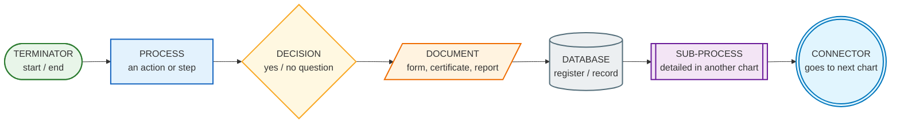
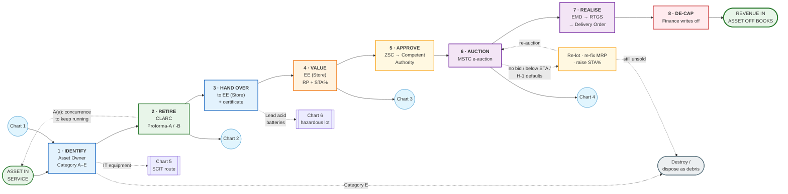
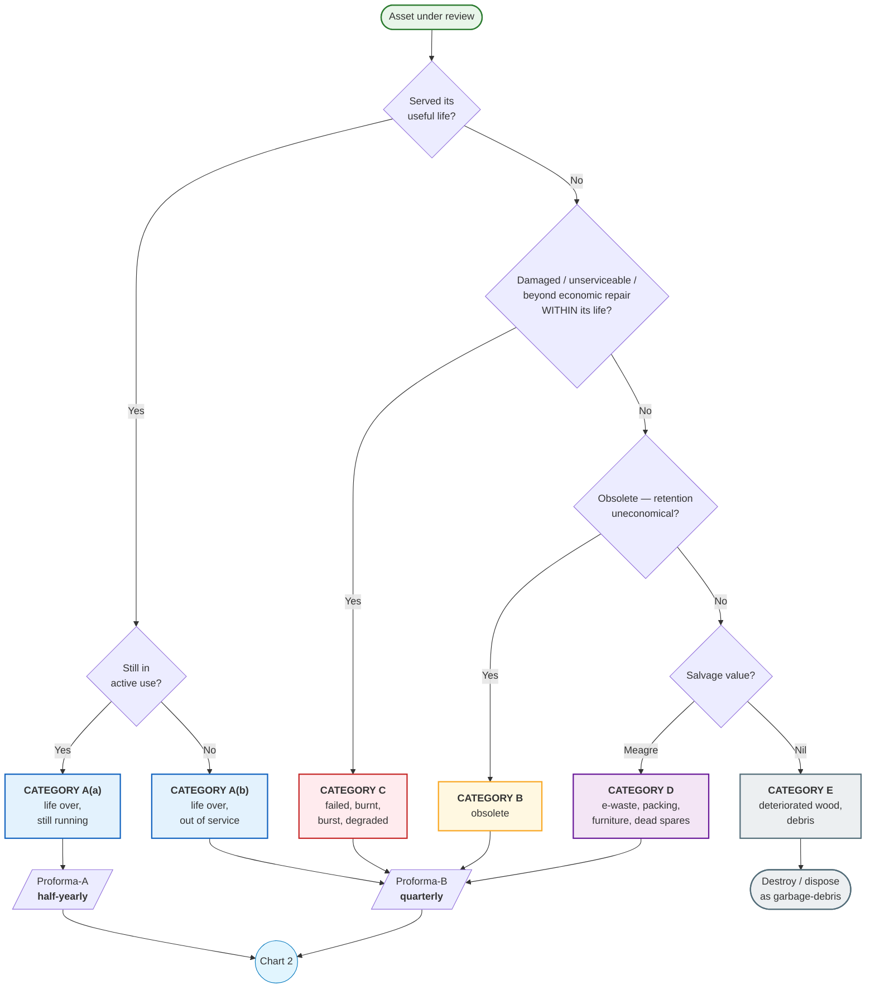
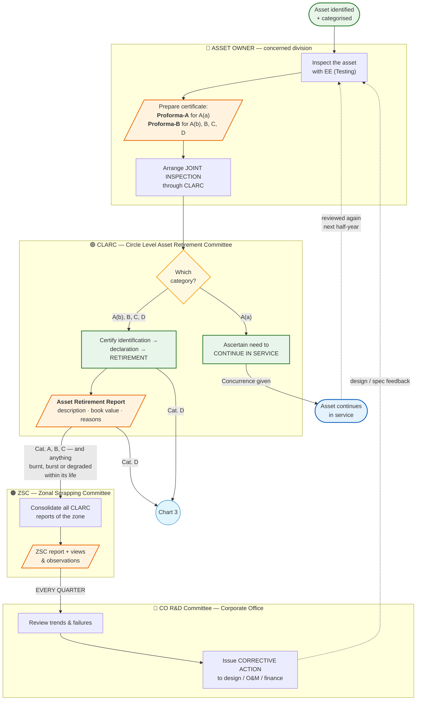
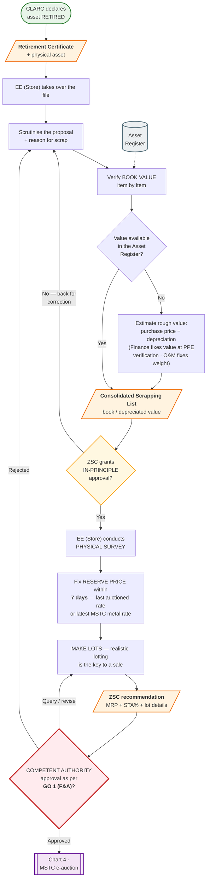
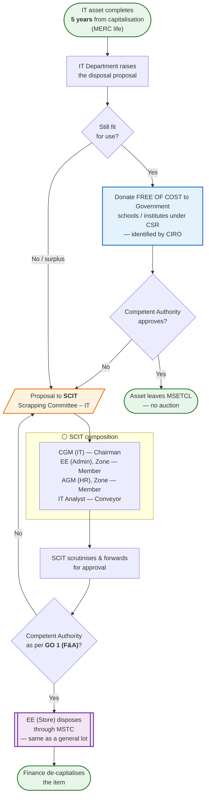
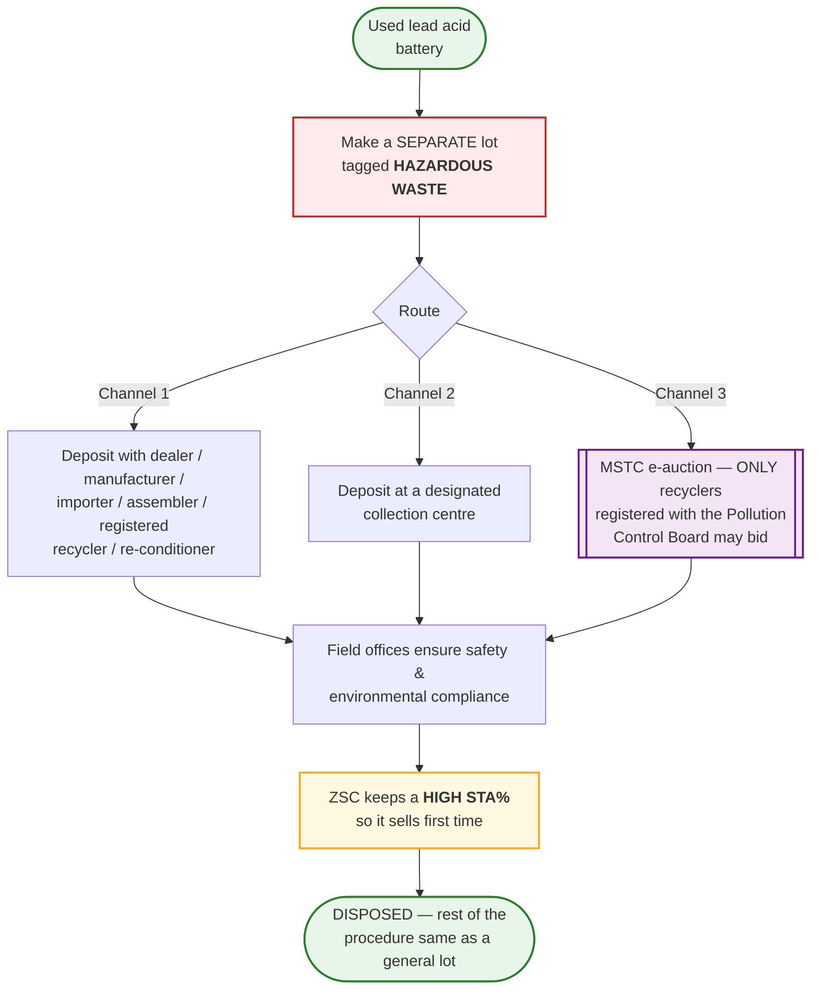

# MSETCL — Asset Retirement, Scrap Declaration & Disposal Policy
### The whole policy as diagrammatic flow charts

Source documents in this repo:
- `Policy.pdf` — the policy circular (signed by Director (Operations))
- `MSA wardha new scrapping policy.pdf` — the 19-slide presentation of the same policy
- `covering letter.pdf` — covering letter from the Chief Engineer (Trans O&M), dated 02.12.2024

The policy is **two halves that run back to back**:

> **Part 1 — ASSET RETIREMENT** (take the asset out of service and out of the books) →
> **Part 2 — SCRAP DECLARATION & DISPOSAL** (sell or destroy the material and recover money).

---

## 1. Flow-chart symbols used



**Colour = who owns the step**

| Colour | Actor |
|---|---|
| 🔵 Blue | Asset Owner / Division |
| 🟢 Green | **CLARC** — Circle Level Asset Retirement Committee |
| 🟠 Amber | **ZSC** — Zonal Scrapping Committee |
| 🔴 Red | **Competent Authority** (GO 1 F&A) / Finance |
| 🟣 Purple | **MSTC** — e-auction platform |
| ⚪ Grey | IT / stores / housekeeping |

---

## 2. Chart 0 — Master flow: the whole policy on one line



| # | Step | Owner | Input → Output | Frequency / clock |
|---|---|---|---|---|
| 1 | Identify & categorise | Asset Owner | Asset → Category A(a), A(b), B, C, D or E | Continuous |
| 2 | Declare retirement | CLARC | Proforma-A / -B → **Retirement Certificate** | A(a) half-yearly · others quarterly |
| 3 | Hand over | Asset Owner → EE (Store) | Asset + certificate → **Store stock register** | Immediately on retirement |
| 4 | Value & lot | EE (Store) | Stock → **Reserve Price + STA% + lots** | RP fixed within **7 days** |
| 5 | Approve | ZSC → Competent Authority | Lot proposal → **approval per GO 1 (F&A)** | ZSC meets quarterly cycle |
| 6 | Auction | MSTC | Approved lot → **H-1 bid** | Bidding **4 h + 8 min × 3** |
| 7 | Realise | Buyer / EE (Store) | 10% EMD + balance by RTGS → **Delivery Order** | EMD **7 days** · lift after DO |
| 8 | De-capitalise | Finance | Sale proceeds → **item removed from Asset Register** | After lifting |

---

## 3. Chart 1 — Which category? (the entry gate)



| Category | Meaning | Form | Reporting | Ends in |
|---|---|---|---|---|
| **A(a)** | Useful life over, **still in active use** | Proforma-A | Half-yearly | Concurrence to continue **or** retirement |
| **A(b)** | Useful life over, **removed from active use** / to be replaced by advanced equipment | Proforma-B | Quarterly | Retirement → scrap |
| **B** | Obsolete, retention uneconomical | Proforma-B | Quarterly | Retirement → scrap |
| **C** | Damaged / unserviceable / beyond economic repair **within** defined life | Proforma-B | Quarterly | Retirement → scrap |
| **D** | Misc. scrap with meagre salvage value — e-waste, packing boxes, containers, furniture, discarded stationery, dead spares | Proforma-B | Quarterly | Retirement → scrap |
| **E** | Nil worth — deteriorated wood, packing, debris | — | — | Destroy / garbage, **no auction** |

> **Gate before retiring (Policy 1.3):** the asset owner must first satisfy that **no alternate economic use exists anywhere in MSETCL**. Only then can retirement start.

---

## 4. Chart 2 — Part 1: Asset Retirement approval chain



| Committee | Composition | Job in this chart |
|---|---|---|
| **CLARC** | SE (O&M) Circle — **Chairman** · EE (O&M) division — **Conveyor** · EE (Testing) — Member · Manager (F&A) — Member | Concurrence for A(a); declare retirement for A(b), B, C, D; issue the Asset Retirement Report |
| **ZSC** | CE, EHV PC O&M Zone — **Chairman** · SE (Testing) — Member · AGM (F&A) — Member · EE (Store) — **Conveyor** | Consolidate every CLARC report → CO R&D each quarter |
| **CO R&D** | Director (Operations) — **Chairman** · CE (O&M) — **Conveyor** · CE (Design) · CGM (Finance) · SE (CPA) | Corrective action on retirement/failure trends |

---

## 5. Chart 3 — Part 2: Scrapping & disposal procedure



| Block | What actually happens |
|---|---|
| Book-value check | Manager (F&A) is the key player. If an item is **not in the Asset Register**, ZSC estimates a rough value from likely purchase price less depreciation; Finance fixes the value during **PPE physical verification**; O&M issues the **weight** guidelines |
| High-value assets | A **separate committee with Technical + Finance members** finalises the standardised valuation method |
| Reserve Price | Minimum RP, fixed within 7 days from the last auctioned rate or the latest scrap rates on the MSTC site |
| After hand-over | General Guideline 6: once the material + certificate reach EE (Store), **all** further approvals till disposal are done by EE (Store) |

---

## 6. Chart 4 — The MSTC e-auction: fate of each lot

```mermaid
flowchart TD
    START(["Lot approved by<br/>Competent Authority"]) --> A1[/"<b>Lot list + HSN + terms</b><br/>sent to MSTC"/]
    A1 --> A2[["MSTC builds the<br/><b>Auction Catalogue</b><br/>(2–3 days)"]]
    A2 --> A3["E-bidding opens<br/><b>4 hours</b> · auto-extension<br/><b>8 min × 3</b>"]
    A3 --> A4(["Auction closes —<br/>result online at once"])
    A4 --> Q1{"Where did the<br/><b>H-1 bid</b> land?"}

    Q1 -->|"H-1 ≥ Reserve Price"| SOLD["<b>CONFIRMED</b><br/>Sale Intimation Letter<br/>auto-issued"]
    Q1 -->|"Between STA floor<br/>and RP"| STA["<b>STA</b> — Subject To Approval<br/>Provisional Sale Intimation Letter"]
    Q1 -->|"Below STA floor"| REJ["<b>REJECTED</b>"]
    Q1 -->|"No bid received"| NOBID["<b>NO BID</b>"]

    STA --> Q2{"Competent Authority<br/>accepts the STA bid?<br/><b>≤ 7 working days</b>"}
    Q2 -->|"Yes"| SOLD
    Q2 -->|"No"| REJ

    SOLD --> EMD["H-1 deposits<br/><b>10% EMD</b> within 7 days"]
    EMD --> Q3{"EMD received?"}
    Q3 -->|"Yes"| PAY["Balance by RTGS ·<br/>CGM/AGM (F&amp;A) confirms<br/>receipt in writing in <b>2 days</b>"]
    Q3 -->|"No — default"| REJ

    PAY --> DO[/"<b>Delivery Order</b>"/]
    DO --> LIFT["EE (Store) facilitates security<br/>clearance, trucks, entry passes"]
    LIFT --> DONE(["<b>DISPOSED</b><br/>→ Chart 3 de-capitalisation"])

    REJ --> RE1["ZSC re-analysis: condition, location,<br/>loading &amp; transport issues"]
    NOBID --> RE1
    RE1 --> RE2["Raise STA% (0–50% band)<br/>and/or re-fix MRP"]
    RE2 --> Q4{"Sold on<br/>re-auction?"}
    Q4 -->|"Yes"| PAY
    Q4 -->|"No"| SHIFT["Shift the lot from<br/>Category A–D → <b>Category E</b><br/>destroy / dispose as debris"]
    SHIFT --> DONE

    style START fill:#e8f5e9,stroke:#2e7d32,stroke-width:2px
    style A4 fill:#f3e5f5,stroke:#6a1b9a,stroke-width:2px
    style DONE fill:#e8f5e9,stroke:#2e7d32,stroke-width:3px
    style SOLD fill:#e8f5e9,stroke:#2e7d32,stroke-width:2px
    style STA fill:#fff8e1,stroke:#f9a825,stroke-width:2px
    style REJ fill:#ffebee,stroke:#c62828,stroke-width:2px
    style NOBID fill:#ffebee,stroke:#c62828,stroke-width:2px
    style SHIFT fill:#eceff1,stroke:#546e7a,stroke-width:2px
    style DO fill:#fff3e0,stroke:#ef6c00,stroke-width:2px
```



**STA in one picture**

```
        Reserve Price (RP)  ───────────────────────────────  H-1 ≥ RP  →  CONFIRMED
                            │                              │
        STA floor           │  RP − (STA% × RP)            │  bid in this band  →  STA (needs approval)
                            │                              │
                            ▼                              ▼
                    below STA floor  →  REJECTED  →  ZSC raises STA% / re-fixes MRP  →  re-auction
```

| Entered by MSETCL | Example 1 | Example 2 |
|---|---|---|
| Reserve Price | ₹ 50,000 | ₹ 10,000 |
| % STA below RP | 10% → ₹ 5,000 | 40% → ₹ 4,000 |
| Lowest bid that survives | ₹ 45,000 | ₹ 6,000 |

- The **same Competent Authority** that approves the minimum RP also approves the **% STA**.
- Any **change in % STA** because a lot stayed unsold must be approved by **ZSC**.
- **Hazardous waste:** keep a high STA% so it sells first time.

---

## 7. Chart 5 — IT equipment (PC, laptop, printer, scanner)



---

## 8. Chart 6 — Used lead acid batteries (hazardous waste)



---

## 9. Chart 7 — The paper trail (every document the policy creates)


---

## 10. Chart 8 — The clock: every deadline in the policy


| When | What | Owner |
|---|---|---|
| **Half-yearly** | Proforma-A for Category A(a) | Asset Owner → CLARC |
| **Quarterly** | Proforma-B for Category A(b), B, C, D | Asset Owner → CLARC |
| **Quarterly** | Consolidated report to CO R&D | ZSC |
| **4× a year** | Auction of approved scrap by each Major Store | EE (Store) |
| **Immediately** | Material replaced under LE scheme / on failure credited to the Major Store or a location identified by EE (Store) — *except ICT / Power Transformer* | Work-executing agency |
| **7 days** | Fix Reserve Price from last auctioned rate / latest MSTC rate | EE (Store) |
| **2–3 days** | MSTC prepares the auction catalogue | MSTC |
| **4 h + 8 min × 3** | E-bidding duration and auto-extensions | MSTC |
| **7 days** | H-1 deposits 10% EMD / security deposit | Buyer |
| **≤ 7 working days** | MSETCL posts acceptance / rejection of STA bids online | Competent Authority → MSTC |
| **2 days** | CGM/AGM (F&A) confirms RTGS receipt in writing | Finance |

---

## 11. Housekeeping rules (General Guidelines)

1. **Misc. scrap below ₹ 5,000** (newspapers, magazines, broken furniture, odd items) is disposed of **regularly by the Office In-charge** — no MSTC auction; do it often to keep premises clean.
2. Every **work order** to a work-executing agency must state that removed material goes to the Major Store or the space identified by EE (Store).
3. **Extra security guard / CCTV** at every Major Store or identified scrap space, if required.
4. If the Major Store is full, EE (Store) identifies space at a **nearby substation**.
5. Once material + retirement certificate reach **EE (Store)**, all further approvals till disposal are handled by EE (Store).
6. After auction, EE (Store) intimates the amount to the division so the equipment can be **written off** in the asset book.
7. All bids are **"as is where is"**, subject to prior inspection; **no photography** of lots by outsiders (security).
8. Amendments are issued whenever needed for smooth implementation.

## 12. Why the policy exists (stated advantages)

- Scrap collects **at one place** instead of being scattered across the zone → **theft risk falls**.
- **One stock register** for all scrap in the zone, kept by the Major Store.
- Scrapping becomes **smooth, fast and simple**; administrative approvals become **directional and fast**.
- **Timely revenue** and **no unnecessary inventory build-up**.
- Sub-station premises stay **aesthetic** — no scrap lying around.
