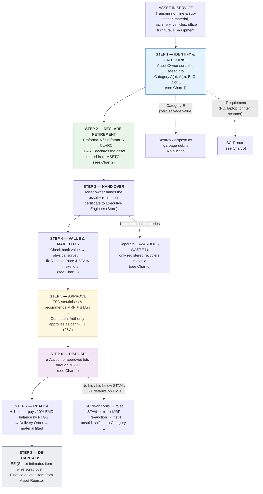
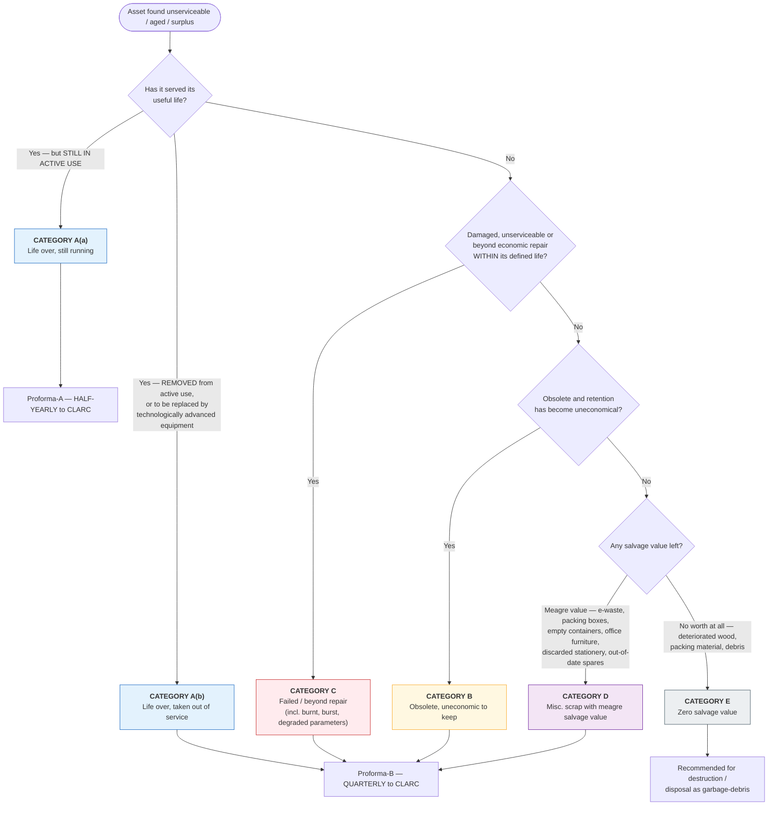
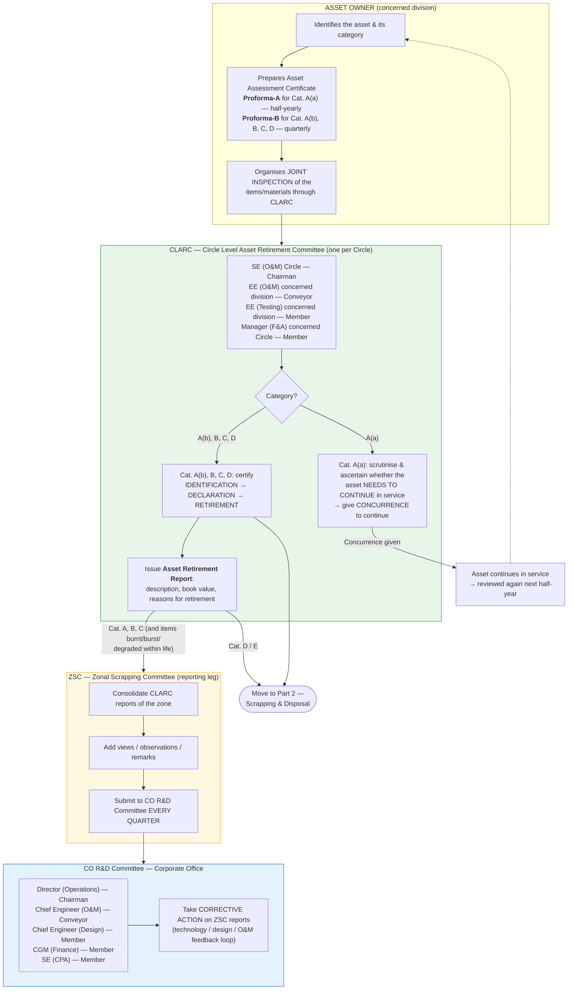
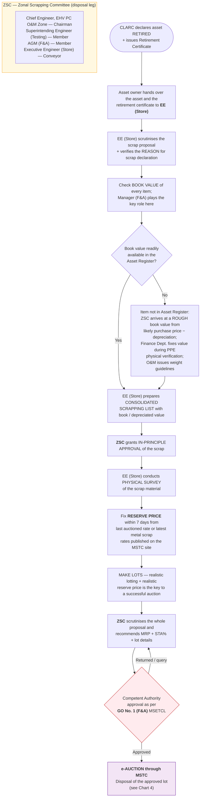
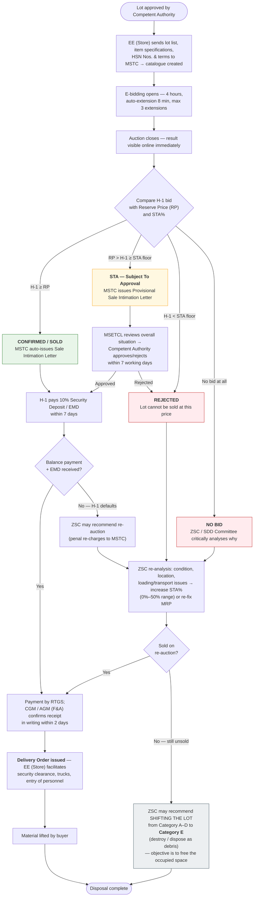
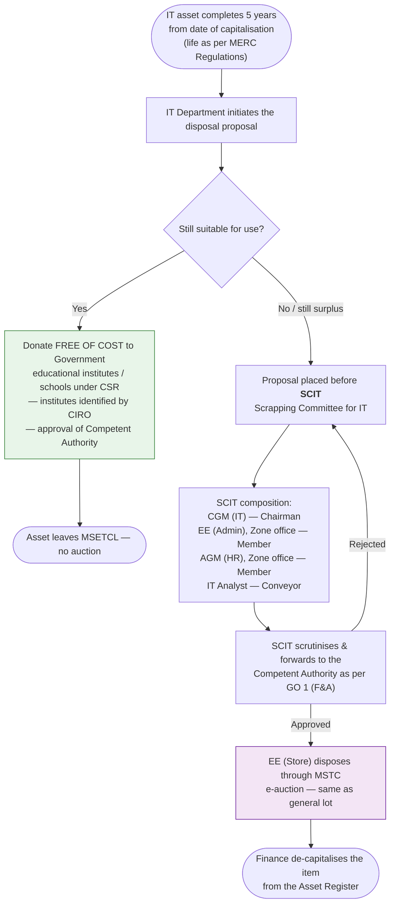
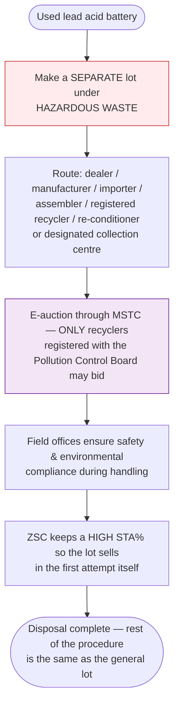

# MSETCL — Asset Retirement, Scrap Declaration & Disposal Policy
### The whole policy explained as flow charts

Source documents in this repo:
- `Policy.pdf` — the policy circular (Ref: MSETCL/CO/Trans(O&M)/…, signed by Director (Operations))
- `MSA wardha new scrapping policy.pdf` — the 19-slide presentation of the same policy
- `covering letter.pdf` — covering letter from the Chief Engineer (Trans O&M) dated 02.12.2024

The policy has **two halves** that run one after the other:

> **Part 1 — ASSET RETIREMENT** (take the asset out of the books/service) → **Part 2 — SCRAP DECLARATION & DISPOSAL** (sell/destroy the physical material and recover money).

---

## 0. Master flow — one page, end to end

---

## 1. Chart 1 —Which category does the asset fall in? (the entry gate)

Every asset is first sorted into one of six buckets. The category decides **which form is used** and **how often** it is reported.

> **Gate before retiring (Policy 1.3):** before anything is retired, the asset owner must first satisfy that **no alternate economic use exists anywhere within MSETCL**. Only then is retirement started.

---

## 2. Chart 2 — Part 1: Asset Retirement approval chain

Four bodies sit in a row: **Asset Owner → CLARC → ZSC → CO R&D Committee**.

---

## 3. Chart 3 — Part 2: Scrapping & disposal procedure

Once CLARC declares the asset retired, **EE (Store) drives the file from here till the money is realised** (General Guideline 6).

**Valuation of high-value assets:** a *separate committee with Technical + Finance members* finalises the standardised valuation method.

---

## 4. Chart 4 — The MSTC e-auction: what happens to each lot

MSTC portal mechanics: catalogue prepared in 2–3 days, bidding runs **4 hours**, auto-extended by **8 minutes** whenever a bid lands in the last 8 minutes (**3 auto-extensions**). H-1 (highest bid) is always visible; bidder identity is not.

**STA explained with the policy's own example**

| Entered by MSETCL | Example 1 | Example 2 |
|---|---|---|
| Reserve Price (RP) | ₹ 50,000 | ₹ 10,000 |
| % STA below RP | 10% (i.e. ₹ 5,000) | 40% (i.e. ₹ 4,000) |
| Lowest bid that stays alive | ₹ 45,000 | ₹ 6,000 |

- Reserve Price must be entered as a **minimum**.
- The **same Competent Authority** that approves the minimum RP is also empowered to approve the **% STA**.
- Any **variation in % STA** (lot remaining unsold) must be approved by **ZSC**.
- Hazardous waste: ZSC should keep a **high STA%** so the lot sells in the first attempt.

---

## 5. Chart 5 — IT equipment (PCs, laptops, printers, scanners)

---

## 6. Chart 6 — Used lead acid batteries (hazardous waste)

---

## 7. Who does what — at a glance

| Body | Full name | Composition | Main job |
|---|---|---|---|
| **Asset Owner** | Concerned division | — | Identify, categorise, prepare Proforma-A/B, arrange joint inspection, hand over asset |
| **CLARC** | Circle Level Asset Retirement Committee | SE (O&M) Circle – Chairman; EE (O&M) – Conveyor; EE (Testing) – Member; Manager (F&A) – Member | Concurrence for A(a); declare retirement for A(b), B, C, D; issue Retirement Report |
| **ZSC** | Zonal Scrapping Committee | CE, EHV PC O&M Zone – Chairman; SE (Testing) – Member; AGM (F&A) – Member; EE (Store) – Conveyor | Consolidate CLARC reports → CO R&D; in-principle approval; recommend MRP + STA%; re-analysis of unsold lots |
| **CO R&D** | Corporate Office Research & Development Committee | Director (Operations) – Chairman; CE (O&M) – Conveyor; CE (Design); CGM (Finance); SE (CPA) | Corrective action on retirement trends |
| **SCIT** | Scrapping Committee for IT | CGM (IT) – Chairman; EE (Admin); AGM (HR); IT Analyst – Conveyor | Scrutinise IT disposal proposals |
| **Competent Authority** | As per GO No. 1 (F&A), MSETCL | Delegated financial powers | Final approval of RP, % STA, lot details |
| **MSTC** | Metal Scrap Trade Corporation | E-auction platform | Catalogue, bidding, sale/delivery orders, payment collection |

---

## 8. The clock — every deadline in the policy

| When | What | Owner |
|---|---|---|
| **Half-yearly** | Proforma-A for Category A(a) | Asset Owner → CLARC |
| **Quarterly** | Proforma-B for Category A(b), B, C, D | Asset Owner → CLARC |
| **Quarterly** | ZSC consolidated report to CO R&D | ZSC |
| **Quarterly (4× a year)** | Auction of approved scrap by each Major Store | EE (Store) |
| **Immediately** | Replaced material (LE scheme / failure) credited to Major Store or location identified by EE (Store) — *except ICT / Power Transformer* | Work-executing agency / Asset Owner |
| **Within 7 days** | Fix Reserve Price from last auctioned rate / latest MSTC scrap rate | EE (Store) |
| **2–3 days** | MSTC prepares the auction catalogue | MSTC |
| **4 hours + 8 min × 3** | E-bidding duration and auto-extensions | MSTC |
| **Within 7 days** | H-1 bidder deposits 10% EMD / security deposit | Buyer |
| **≤ 7 working days** | MSETCL communicates acceptance/rejection of STA bids | Competent Authority → MSTC |
| **Within 2 days** | CGM/AGM (F&A) confirms receipt of RTGS payment in writing | Finance |

---

## 9. Housekeeping rules (General Guidelines)

1. **Small misc. scrap below ₹ 5,000** (newspapers, magazines, broken furniture, misc. items) is disposed of **regularly by the Office In-charge** — no MSTC auction. It must be done frequently to keep premises clean.
2. Every **work order** issued to a work-executing agency must state that removed material will be moved from site to the Major Store / space identified by EE (Store).
3. **Additional security guard / CCTV** at every Major Store or identified scrap space, if required.
4. If the Major Store has no space, EE (Store) identifies space at a **nearby substation**.
5. Once the material and retirement certificate reach **EE (Store)**, *all* further approvals up to disposal are handled by EE (Store) — the division is not chased again.
6. After the auction, EE (Store) intimates the auctioned amount to the division so the equipment can be **written off** in the asset book.
7. All bids are on **"as is where is basis"**, subject to prior inspection; **no photography** of lots by outsiders/bidders (security).
8. Amendments to the policy are carried out whenever required for smooth implementation.

## 10. Why the policy exists (stated advantages)

- Scrap accumulates **at one place** instead of being scattered across the zone → **theft risk drops**.
- **One single stock register** of scrap for the whole zone, kept by the Major Store.
- Scrapping becomes **smooth, fast and simple**; administrative approvals become **directional and fast**.
- **Timely revenue** to MSETCL and **no unnecessary inventory build-up**.
- Sub-station premises stay **aesthetic** — no scrap lying around.
