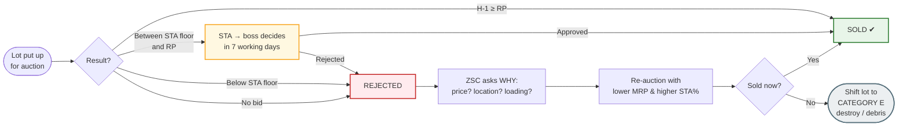

# The Scrap Story
### MSETCL's Asset Retirement, Scrap Declaration &amp; Disposal Policy — explained like a story, for someone who knows nothing

> **Who this is for:** You have just been handed responsibility for scrapping in your zone/circle. You have never done this before. You don't know what CLARC, ZSC, STA or MSTC mean. By the end of this document you will understand the whole policy, and you will be able to explain it to your junior in two minutes.

**Prefer diagrams? Open [flowchart.html](flowchart.html) — the same policy drawn as flow charts.**

---

## Part 0 — Before we start

### 0.1 The assumptions I have made

Since you asked me to assume, here is exactly what I am assuming. Change any of these in your head and the story still works — only the names change.

| # | Assumption |
|---|---|
| 1 | You work for **MSETCL** (Maharashtra State Electricity Transmission Company Limited) — the state company that carries electricity across Maharashtra. |
| 2 | You have just been made the **in-charge of the scrapping process** for your zone — you chair or convey the committee, and juniors report to you. |
| 3 | Your juniors are engineers and store-keepers who are good at their technical work but have **never handled a disposal file**. |
| 4 | Our example zone is **Amravati Zone** and our example sub-station is **132 kV Wardha sub-station** — Wardha is where the presentation in this repo was made. |
| 5 | Our hero asset is a power transformer called **T-1**. |
| 6 | All **money figures in the story are illustrative** — made up to make the arithmetic easy. The *method* is real; the *numbers* are examples. |
| 7 | The policy text is from `Policy.pdf` and `MSA wardha new scrapping policy.pdf` in this repository. Where the policy is silent or unclear, I say so. |

### 0.2 The twelve scary words, in plain language

Read this table once and the rest of the document becomes easy.

| Word | What it really means | Everyday comparison |
|---|---|---|
| **Asset** | Anything costly that the company owns — a transformer, a breaker, a vehicle, a computer, a cupboard | Your scooter, your fridge |
| **Asset Register** | The master list of every asset the company owns, with its price and age | The "birth register" of company property |
| **Retirement** | Declaring officially: "this item is no longer part of our working system" | An employee retiring — name struck off the muster roll |
| **Scrap** | The physical junk left after retirement — metal, wood, e-waste | Old newspapers and broken furniture at home |
| **Book value** | What the item is still *worth on paper* after years of wear | The resale value written for your 15-year-old scooter |
| **Depreciation** | The loss in value every year because of age and use | Your phone losing value every year |
| **Reserve Price (RP)** | The **minimum** price below which you refuse to sell | The "upset price" in an auction |
| **STA** | *Subject To Approval* — you may accept a little less than RP, but only if your boss approves | "I'll take ₹45,000, but let me ask my father first" |
| **Lot** | A single bundle of scrap sold as one unit | A combo pack / thali at a restaurant |
| **H-1** | The **highest** bidder (H-2 is second highest, and so on) | The person who shouted the biggest number |
| **EMD / SD** | Earnest Money Deposit / Security Deposit — the token advance the buyer pays to prove he is serious | The token amount you pay when you book a flat |
| **De-capitalisation** | Removing the item from the Asset Register after it is sold | Deleting a retired employee's name from the payroll |

### 0.3 And the seven offices you will keep hearing about

| Short name | Full name | Think of it as |
|---|---|---|
| **Asset Owner** | The engineer in whose sub-station/division the item sits | The person who "owns" the item, like the driver of a company jeep |
| **EE (Store)** | Executive Engineer (Store) | The warehouse manager — he runs the file from hand-over to sale |
| **CLARC** | Circle Level Asset Retirement Committee | The taluka-level committee that declares retirement |
| **ZSC** | Zonal Scrapping Committee | The zone-level committee that approves the sale |
| **CO R&D** | Corporate Office Research & Development Committee | The head-office think tank that studies why things fail |
| **Competent Authority** | The officer with financial power under **GO No. 1 (F&A)** | The person who holds the cheque-signing power |
| **MSTC** | Metal Scrap Trade Corporation Ltd. | A government-owned online auction company — "OLX/eBay for scrap" |

---

## Part 1 — The world you have just inherited

### 1.1 What MSETCL actually does

Imagine electricity as **traffic** and the transmission network as **highways**.

- Power stations (generators) are like factories on the edge of the city.
- Distribution companies (MSEDCL, etc.) are like the small roads that reach your house.
- **MSETCL is the highway in between.** It takes bulk power at very high voltage and carries it across the state.

How big is this highway? The covering letter in this repo tells us:

> **51,518 circuit kilometres** of transmission lines, **742 EHV sub-stations**, **138,598 MVA** of transformation capacity. MSETCL is the largest state transmission utility in the country.

A **sub-station** is like a **bus depot and junction** rolled into one: power comes in at high voltage, gets stepped down, and goes out on different routes. The machine that steps the voltage up or down is the **transformer** — think of it as the **gearbox** of the power system.

### 1.2 Why scrap is a real problem, not a small problem

Three things happen in a network this old and this large:

**1. Equipment grows old.** A transformer bought in 1988 has been standing in the sun, rain and load for decades. Its insulation weakens, oil leaks, and one day it fails without warning. The policy says this clearly: because of old age, performance degrades, and such equipment **must be retired before it causes an interruption**.

**2. Scrap piles up.** Every replacement leaves behind junk — old conductors, broken insulators, failed breakers, rusted structures, used batteries, empty cable drums, old computers. In the old days it just lay in a corner of the sub-station.

**3. Lying scrap creates three risks:**
- **Theft** — copper and aluminium have high resale value. Scrap lying in a remote sub-station attracts thieves.
- **Wasted space & ugly premises** — a sub-station full of junk looks neglected and blocks work.
- **Lost money** — that junk is worth real cash if sold properly through auction.

So the company framed this policy to do three jobs at once: **retire unsafe equipment in time, dispose of the junk honestly and transparently, and earn revenue while doing it.**

### 1.3 The one sentence that explains the whole policy

> **First take the item out of service officially (RETIREMENT), then sell or destroy the physical junk transparently through online auction (DISPOSAL) — and finally delete its name from the Asset Register (DE-CAPITALISATION).**

Everything in the policy is a detail of that one sentence.

---

## Part 2 — Meet the cast (who decides what)

Think of the policy as a **school system**.

| Level | Body | Who sits in it | What they decide | Comparison |
|---|---|---|---|---|
| **Ground** | **Asset Owner** (JE/AE/EE of the division) | The engineer responsible for that equipment | "This item is finished. Here are my reasons and my form." | The class teacher who reports a problem |
| **Circle** | **CLARC** | SE (O&M) Circle — **Chairman**; EE (O&M) division — **Conveyor**; EE (Testing) — Member; Manager (F&A) — Member | "Yes, it is genuinely finished — **retired**." or "No, keep using it." | The school committee |
| **Zone** | **ZSC** | CE, EHV PC O&M Zone — **Chairman**; SE (Testing) — Member; AGM (F&A) — Member; EE (Store) — **Conveyor** | "The list is correct. In-principle approval given. We recommend Reserve Price ₹X, STA Y%, and these lots." | The district education officer |
| **Head office** | **CO R&D Committee** | Director (Operations) — **Chairman**; CE (O&M) — **Conveyor**; CE (Design), CGM (Finance), SE (CPA) — Members | "Why are so many transformers failing at 20 years? Change the design/specification." | The textbook committee that fixes root causes |
| **Finance** | **Competent Authority** as per **GO No. 1 (F&A)** | The officer holding delegated financial power | "Approved — sell it." This is the final signature. | The person who signs the cheque |
| **Outside** | **MSTC** | A government e-auction company | Runs the auction, collects money, issues the Delivery Order | The auctioneer |
| **Special** | **SCIT** (IT scrap) | CGM (IT) — **Chairman**; EE (Admin) — Member; AGM (HR) — Member; IT Analyst — **Conveyor** | IT equipment disposal (computers, printers) | A separate committee for computers |

> **The single most useful thing to remember:** after the asset owner hands over the item to **EE (Store)**, *every* further approval until the item leaves the gate is done by EE (Store). This is General Guideline 6 of the policy. The division is not chased again.

---

## Part 3 — The six boxes: which category does my item fall into?

Before anything else, every item must be put into one of **six boxes**. The box decides which form you fill and how often you report.

| Box | In plain language | Real example |
|---|---|---|
| **A(a)** | Completed its life but **still working fine and still in use** | A 35-year-old transformer that is still carrying load without trouble |
| **A(b)** | Completed its life and **taken out of use** — or being replaced by better technology | The old electromechanical relay panel removed when a numerical relay panel came in |
| **B** | Not broken, but **obsolete** — keeping it costs more than it is worth | A CRT monitor or a DOS-based computer nobody can repair |
| **C** | **Damaged / unserviceable / beyond economic repair** — and this happened *within* its life | A breaker that burst, a transformer that burnt |
| **D** | Odds and ends with **very little** value | E-waste, packing boxes, empty drums, old furniture, discarded stationery, out-of-date spares |
| **E** | **Worthless** — no buyer, no value | Deteriorated wood, rotten packing material, debris |

**A quick way to remember:** A = old, B = outdated, C = broken, D = junk with a little value, E = junk with no value.

### The gate before you retire anything

The policy puts a condition before retirement (clause 1.3): you must first satisfy yourself that **there is no other economic use for the item anywhere in MSETCL**.

In plain language: *"Before you declare this old transformer dead, check whether some other sub-station in Maharashtra can use it as a spare."* Only when the answer is "nobody can use it" do you start retirement.

---

## Part 4 — The story of Transformer T-1

Now the whole policy as one continuous story. Follow T-1 from the sub-station to the weighbridge.

### Chapter 1 — A junior engineer notices a problem

**Baban**, a Junior Engineer at 132 kV Wardha sub-station, has looked after T-1 for six years. T-1 was commissioned in **1988**. It is a 25 MVA, 132/33 kV transformer. In the last year Baban has noticed:

- oil seeping from the gasket,
- the winding temperature running high in summer,
- BDV (breakdown voltage) of the oil falling below limit even after filtration,
- two forced outages in six months.

Baban's first thought — "should I get it repaired?" — is exactly the right first question. The policy wants you to ask: **is repair economical?** In T-1's case, a rewind would cost more than a new transformer, and the old core is inefficient. Repair is *not* economical.

So Baban decides: **T-1 must be retired.**

### Chapter 2 — The identification form (Proforma-A or Proforma-B)

Baban fills a form. Which one?

- If the item is **A(a)** — old but still running, and he only wants permission to keep using it — he fills **Proforma-A**, the *Asset Assessment Certificate*, and sends it **twice a year** (half-yearly).
- If the item is **A(b), B, C or D** — genuinely to be retired — he fills **Proforma-B**, the *Asset Retirement Certificate*, and sends it **every three months (quarterly)**.

T-1 is old, out of favour and uneconomical to repair — call it **Category A(b) / C**. So: **Proforma-B, quarterly.**

Think of Proforma-B as the **"retirement application"** of the transformer. It records what the item is, where it is, how old it is, why it should go, and what it is worth on paper.

Baban also does one more thing the policy requires: he **organises a joint inspection** through CLARC. That means he doesn't write the form alone in his room — the O&M engineer, the **Testing** engineer and the **Finance (F&A)** person physically see T-1 and sign. Three pairs of eyes stop fake or careless retirement.

### Chapter 3 — The CLARC meeting (the retirement decision)

The **Circle Level Asset Retirement Committee** meets. In the room:

- **SE (O&M) Circle** — Chairman. He asks: *"Is the network safe if this goes?"*
- **EE (O&M) of the division** — Conveyor. He has put the file together.
- **EE (Testing)** — Member. He asks: *"Do the test results really prove it is finished?"* — oil BDV, winding resistance, IR values.
- **Manager (F&A)** — Member. He asks: *"What is its book value? Is anything left to depreciate?"*

Two outcomes are possible:

1. **For A(a) items** — CLARC says *"continue in service"* and records its **concurrence**. The item keeps working and is reviewed again after six months.
2. **For A(b), B, C, D items** — CLARC **certifies retirement**: identification → declaration → retirement. For T-1, CLARC declares it **retired from MSETCL**.

CLARC then prepares the **Asset Retirement Report**: the name and description of the item, its book value, and the reasons for retirement.

### Chapter 4 — Two reporting lines out of CLARC

CLARC's retirement report travels on **two different tracks**. This confuses many people, so watch carefully:

**Track 1 — the money track (to ZSC):** the report goes to the Zonal Scrapping Committee, which consolidates all such reports from the zone and processes them for sale. This happens for categories **A, B and C** — and specifically for anything that **burnt, burst, or showed degraded technical parameters within its life** (that is important: a failure inside the expected life is a red flag worth reporting upward).

**Track 2 — the learning track (to CO R&D):** ZSC adds its own views and remarks and sends a consolidated report **every quarter** to the Corporate Office R&D Committee. That committee — chaired by the Director (Operations) — asks the bigger question: *"Why did a transformer fail in 20 years when it should have lasted 25? Is there a design or specification problem?"* Then it orders corrective action.

So the same dead transformer produces **revenue** on one track and **knowledge** on the other.

### Chapter 5 — Handing over the keys (this is the turning point)

CLARC has declared T-1 retired. Now the physical item and the retirement certificate are **handed over to EE (Store)**.

From this moment:

- The item moves to the **Major Store** (or to a space that EE (Store) identifies — if the store is full, he may use space at a nearby sub-station).
- It is entered in **one single stock register** for the whole zone.
- **Security guard / CCTV** is arranged if needed.
- **All further approvals until disposal are handled by EE (Store).** Baban is free to go back to running the sub-station.

There is one important exception in the policy: material replaced under an **LE (Life Extension) scheme** or after a **failure** must be credited to the store — **except ICT / Power Transformers**, which need separate handling.

The policy also says something smart: **every work order given to a contractor must contain a line** saying that the removed material will be moved from site to the Major Store immediately. So the contractor who installs the new transformer is contractually bound to cart the old one away.

### Chapter 6 — What is it worth? (book value)

EE (Store) now has to put a **value** on the junk. Two questions:

**Question 1 — Is the item in the Asset Register?**
The Asset Register is the official list of company property. Big items like transformers are always in it. EE (Store) verifies the **book value** of every item, with the **Manager (F&A)** playing the key role.

**Question 2 — What if the item is NOT in the register?**
This happens surprisingly often with small things — an old cupboard, a cable drum, a rusted tank. The policy's answer:
- The **ZSC may arrive at a rough book value** by asking: what would it have cost when new? How much has it depreciated? What is left today?
- The **Finance Department** decides the value during the **physical verification of Property, Plant and Equipment (PPE)**.
- The **O&M wing** finalises guidelines for **weight** (for metal sold by kilogram).
- For **high-value** assets, a **separate committee with technical and finance members** finalises a standard valuation method.

**A simple example.** Assume T-1 was purchased in 1988 for ₹2 crore and the company depreciates transformer assets over 25 years. On paper, after full depreciation, only a small scrap value remains — say **₹1 lakh** *(illustrative number)*. That ₹1 lakh is the **book value**: what the accounts still show. Note carefully — book value is an *accounting* number. What a scrap dealer will actually pay depends on **metal rates**, not on the register.

### Chapter 7 — The consolidated list and the in-principle approval

EE (Store) prepares a **Consolidated Scrapping List** — every item with its book or depreciated value — and places it before **ZSC**.

ZSC grants **in-principle approval**. Translation: *"Yes, in principle this junk may be sold. Now go and do the ground work properly."*

### Chapter 8 — The ground work: survey, reserve price, lots

Three things happen now, and they decide whether the auction succeeds or fails.

**(a) Physical survey.** EE (Store) or his team physically inspects the material: what is it, how much of it, in what condition, where is it lying, can a truck reach it?

**(b) Fix the Reserve Price — within 7 days.** The rule: base it on the **last auctioned rate** or on the **latest metal scrap rates published on the MSTC website**. The clock is **7 days** — you price against today's market, not last year's.

**(c) Make lots.** Combine sensible items into saleable bundles.

The policy says something very practical here: **"Making lots and fixing a realistic Reserve Price is key to successful scrap disposal."** In other words, an over-priced lot helps nobody — it just sits there.

**Let us price T-1's remains *(illustrative arithmetic)*:**

| Material | Quantity | Assumed rate | Value |
|---|---|---|---|
| Copper winding / bushing copper | 2 tonnes | ₹600 / kg | ₹12,00,000 |
| Transformer steel / core | 8 tonnes | ₹30 / kg | ₹2,40,000 |
| Aluminium radiators & fittings | 1 tonne | ₹150 / kg | ₹1,50,000 |
| Insulating oil (if saleable) | 10,000 litres | ₹40 / litre | ₹4,00,000 |
| **Gross indicative value** | | | **₹19,90,000** |

Now apply judgement. The scrap is lying in a remote sub-station; the buyer must arrange his own cutting, loading and transport; oil may need testing for PCB content. So EE (Store) proposes a **Reserve Price of ₹18 lakh** — slightly below gross value, to attract bidders.

EE (Store) then creates **Lot No. 3 — "Wardha Zone mixed scrap"**, which contains T-1 plus a few other retired items, so that the lot is big enough to interest a serious dealer.

### Chapter 9 — ZSC recommends, Competent Authority approves

ZSC scrutinises the entire proposal and forwards its **final recommendation** — the **MRP (Minimum Reserve Price)**, the **STA percentage**, and the **lot details** — to the **Competent Authority** as per **GO No. 1 (F&A)** of MSETCL.

For our lot, assume ZSC recommends:

- **MRP: ₹18,00,000**
- **STA: 10%** → the lot stays alive down to **₹16,20,000**
- **Lot No. 3, Wardha Zone mixed scrap**

The Competent Authority approves. Now — and only now — can the material be sold.

---

## Part 5 — Auction day: selling T-1 on MSTC

### 5.1 Setting up the auction

EE (Store) sends MSTC the **list of lots**, with the description of each item, **HSN codes** and the **terms and conditions** — preferably by email, followed by hard copies.

MSTC then:

1. **Creates the auction** and emails MSETCL the **auction number and schedule**.
2. **Builds the auction catalogue within 2–3 days** — terms, material description, quantity.
3. EE (Store) **checks the catalogue** and reports any error.

### 5.2 Inspection — welcome the dealers

Here is a detail juniors often get wrong. Once the auction is published, **scrap dealers physically visit MSETCL premises** to inspect the material. The policy says clearly: **facilitate them smoothly**, and it is wise to **record their names and contact numbers**.

Think about it from the dealer's side. He is bidding lakhs of rupees on material he has never touched. If your store-keeper turns him away, he either bids very low or doesn't bid at all. Every rupee of courtesy converts into rupees of bid price.

**Security rule:** bids are on **"as is where is"** basis, subject to prior inspection, and **no photography** of lots by outsiders is allowed (campus security).

### 5.3 The bidding

- Bidding runs for **4 hours** initially.
- If a bid arrives in the **last 8 minutes**, the closing time **auto-extends by 8 minutes**. This can happen up to **3 times**. (This prevents "sniping" — someone sneaking in a bid at the last second.)
- At any moment the screen shows the **H-1 (highest) bid** — but **never the bidder's name**.
- Anyone can see the **last 10 bids**.
- The moment the auction closes, the result is visible online: which lots are **confirmed** and which are **STA**.

### 5.4 Our auction closes — and it lands in STA

Assume the highest bid (**H-1**) for Lot No. 3 is **₹17,10,000**.

Our Reserve Price was ₹18,00,000. So the bid is **below RP** — but it is **above the STA floor** of ₹16,20,000.

What happens? The lot does **not** get rejected. It goes into **STA — Subject To Approval** mode. MSTC automatically issues a **Provisional Sale Intimation Letter** to the H-1 bidder, "subject to approval of MSETCL".

### 5.5 What STA actually means — the policy's own example

| | Example 1 | Example 2 |
|---|---|---|
| Reserve Price entered by MSETCL | ₹50,000 | ₹10,000 |
| % STA below RP | 10% → ₹5,000 | 40% → ₹4,000 |
| Lowest bid that stays alive | **₹45,000** | **₹6,000** |

Read it like this: *"I have fixed ₹50,000 as my minimum, but if somebody offers ₹46,000 I won't throw the offer away — I'll put it up to my boss, because selling at ₹46,000 today is better than storing it for six more months and re-auctioning."*

Three rules from the policy:
1. The **same Competent Authority** that approves the minimum Reserve Price also has the power to approve the **% STA**.
2. If a lot remains unsold and ZSC wants to **change the STA%**, that change must be approved by **ZSC**.
3. ZSC generally works in a **0% to 50% range**, case by case.

### 5.6 The decision, the money, the gate pass

Back to our lot at ₹17,10,000.

1. **MSETCL reviews.** The ZSC/Competent Authority reviews the overall situation and takes a final decision. The policy fixes a discipline: the decision must be communicated **within 7 working days** of the auction closing, by posting it online.
2. **If approved** — MSTC asks the H-1 bidder to deposit **10% Security Deposit / EMD** (here, ₹1,71,000) within **7 days**.
3. **Balance payment** is made by **RTGS**.
4. **Finance confirms.** The **CGM / AGM (F&A)** confirms receipt of payment **in writing within 2 days** to EE (Store)/the division.
5. **Delivery Order** is issued.
6. **Lifting.** The buyer's trucks arrive. EE (Store) must **actively support** smooth lifting: security clearance of the site, facilitating deployment of trucks, entry passes for the buyer's authorised personnel, weighment, gate pass.
7. **Handover complete.**

### 5.7 The last page of the story — deleting the name

After the sale, EE (Store) intimates the **item-wise scrap cost** to the asset owner (Baban's division) and to Finance.

Finance then **de-capitalises** the item: T-1's name is struck off the Asset Register, and the sale proceeds are properly accounted for. The new transformer that replaced it is **capitalised**. The circle is complete.

---

## Part 6 — When the story doesn't end happily

Not every lot sells first time. The policy plans for three failures.

### Failure 1 — Nobody bid at all

**Why?** Usually one of: the reserve price was unrealistic, the material is in an unreachable place, the lot is badly mixed, or loading/transport costs eat the profit.

**What the policy says:** the issue must be **critically analysed** by the committee and by ZSC — condition of the scrap, its location, loading/unloading, transportation and other practical issues — **before** fixing the MRP and STA% again. Facilitate dealer inspections and keep their contact numbers.

### Failure 2 — There was a bid, but below even the STA floor

The lot is **rejected** and cannot be sold at that price. Same analysis as above; then ZSC recommends a **new proposal and strategy** — usually a lower MRP and a higher STA%.

### Failure 3 — The H-1 bidder won but never paid the EMD

Rare, but it happens. ZSC may recommend **re-auction**, and penal re-charges may apply to the defaulting party through MSTC.

### The exit door: shifting the lot to Category E

If a lot fails again and again, ZSC may recommend **shifting the lot from Category A–D to Category E** — that is, **destroy it or dispose of it as garbage/debris**.

Why would you do that instead of selling? Because the stated **objective is to get rid of the scrap and free the occupied space**. A lot that occupies a store for two years costs more in space, security and administration than it earns in a marginally better bid next year.

**Special case — hazardous waste:** the policy advises ZSC to keep a **high STA%** for hazardous lots so that they sell **in the first attempt itself**.



---

## Part 7 — Three special stories

### 7.1 The computer story (IT equipment)

In the accounts section there are 20 desktop computers bought in 2018. MERC regulations give such equipment a **life of 5 years**. They are now well past that life.

The IT department starts the disposal proposal. Now there is a special first question, and it is a beautiful one:

> **Are they still usable?**

If **yes** — the policy says such computers may be **donated free of cost to Government educational institutes and schools under CSR**, with the approval of the Competent Authority. The institutes are identified by **CIRO**. So a computer that is too slow for a sub-station may still be perfect for a Zilla Parishad school computer lab.

If they are **not usable**, or if some still remain after donation, the file goes to **SCIT** — the Scrapping Committee for IT:

- **CGM (IT)** — Chairman
- **EE (Admin), Zone office** — Member
- **AGM (HR), Zone office** — Member
- **IT Analyst** — Conveyor

SCIT scrutinises the proposal and forwards it to the Competent Authority under **GO 1 (F&A)**. After approval, **EE (Store) disposes of them through MSTC**, exactly like any other lot. Finally, Finance de-capitalises them.

*(Note: the policy states the MERC life as 5 years "at present" — always check the latest MERC regulation, because this number can change.)*

### 7.2 The battery story (used lead acid batteries)

At every sub-station there is a battery bank that supplies control power when everything else fails. When those batteries are used up, they are **hazardous waste** — full of lead and acid. You cannot simply sell them to the highest bidder.

The policy's rules:

1. Make a **separate lot tagged as hazardous waste**.
2. In the MSTC auction, **only recyclers registered with the Pollution Control Board may bid**.
3. Alternatively, deposit them with the **dealer / manufacturer / importer / assembler / registered recycler / re-conditioner**, or at a **designated collection centre**.
4. Field offices must follow **safety and environmental** norms.
5. ZSC should keep a **high STA%** so the lot sells first time.

Everything else — reserve price, EMD, delivery order — is the same as a general lot.

### 7.3 The small-stuff story (scrap below ₹5,000)

Old newspapers, magazines, broken furniture and small miscellaneous items worth **less than ₹5,000** do **not** go to MSTC. The **Office In-charge disposes of them regularly**.

The policy adds a purpose: this must be done **frequently, so the office premises stay neat and clean at all times**. Translation: don't wait for a committee to clear yesterday's newspapers.

---

## Part 8 — Your job: what you must actually do

If you are the person in charge, here is your working calendar and your control checklist.

### 8.1 The clock you must respect

| When | What must happen | Who |
|---|---|---|
| **Continuously** | Identify assets that are old, damaged, obsolete or surplus | Asset Owner (your juniors) |
| **Half-yearly** | **Proforma-A** for Category A(a) items | Asset Owner → CLARC |
| **Quarterly** | **Proforma-B** for Category A(b), B, C, D items | Asset Owner → CLARC |
| **Immediately on retirement** | Physical asset + retirement certificate handed to EE (Store) | Asset Owner |
| **Quarterly (4 times a year)** | Auctions held by each Major Store | EE (Store) |
| **Quarterly** | Consolidated retirement report to CO R&D | ZSC |
| **Within 7 days** | Fix Reserve Price from last auctioned rate / latest MSTC rate | EE (Store) |
| **2–3 days** | MSTC prepares the catalogue | MSTC |
| **4 hours + 8 min × 3** | E-bidding window and auto-extensions | MSTC |
| **7 days** | Buyer deposits 10% EMD | Buyer |
| **≤ 7 working days** | MSETCL posts acceptance/rejection of STA bids online | Competent Authority |
| **2 days** | Finance confirms RTGS receipt in writing | CGM/AGM (F&A) |

### 8.2 Your control checklist — questions to ask your juniors

Ask these every month. If the answer to any one is "no", you have found a leak.

1. **Is there a retired item lying at any sub-station?** If yes, why has it not reached the Major Store?
2. **Is every item in the store entered in the single stock register?** One register, whole zone.
3. **Is the CCTV / security guard in place** at the store or the identified scrap space?
4. **Did the last two auctions happen this quarter?** The target is four a year.
5. **Were dealers allowed to inspect the lots?** Were their names and phone numbers recorded?
6. **Was the Reserve Price fixed within 7 days from MSTC rates?**
7. **Are the lots sensible?** Heavy copper separate from light junk? Reachable material separate from remote material?
8. **How many lots went unsold last time, and did we record WHY?**
9. **Does every work order contain the clause** that removed material goes to the Major Store?
10. **Were the sold items de-capitalised** from the Asset Register, and was the division informed of the sale amount?

### 8.3 The five most common mistakes

| Mistake | Why it hurts | The rule that prevents it |
|---|---|---|
| Leaving retired material in the sub-station | Theft, space blocked, premises ugly | Hand over to EE (Store) immediately; work-order clause |
| Pricing the lot by "feel" or by last year's rate | No bids, or giveaway pricing | RP within 7 days, from MSTC rates / last auction rate |
| Fixing an unrealistic Reserve Price out of fear of "selling cheap" | Lot rejected, re-auction, six months lost | Realistic lotting + realistic RP + STA cushion |
| Not letting dealers inspect | Low bids or no bids | Facilitate inspection, record contacts |
| Forgetting de-capitalisation | Books show assets that no longer exist | EE (Store) intimates item-wise cost; Finance writes off |

### 8.4 The twelve documents the policy creates

Keep this as your file-movement chart. If a file is missing any of these, it is incomplete.

| # | Document | Created by | Goes to |
|---|---|---|---|
| 1 | **Proforma-A** — Asset Assessment Certificate (half-yearly) | Asset Owner | CLARC |
| 2 | **Proforma-B** — Asset Retirement Certificate (quarterly) | Asset Owner | CLARC |
| 3 | **Asset Retirement Report** (description, book value, reasons) | CLARC | ZSC |
| 4 | **ZSC consolidated report** with views (quarterly) | ZSC | CO R&D |
| 5 | **Retirement Certificate** + physical asset | CLARC / Asset Owner | EE (Store) |
| 6 | **Consolidated Scrapping List** with book / depreciated value | EE (Store) | ZSC |
| 7 | **Survey report + Reserve Price note** (within 7 days) | EE (Store) | ZSC |
| 8 | **Lot proposal: MRP + STA% + lot details** | ZSC | Competent Authority |
| 9 | **Approval under GO 1 (F&A)** | Competent Authority | EE (Store) / MSTC |
| 10 | **Auction catalogue** | MSTC | Bidders + MSETCL |
| 11 | **Sale / Provisional Sale Intimation Letter** | MSTC | H-1 bidder |
| 12 | **Delivery Order** → then **de-capitalisation advice** | MSTC → EE (Store) | Buyer / Finance |

---

## Part 9 — How to explain this to your subordinate

### 9.1 The two-minute script (read this out aloud)

> "Listen. Understand one thing: **nothing in this company is thrown away on the spot, and nothing is sold privately.** There are only two stages.
>
> **Stage one — retire it.** You are the asset owner. If something in your sub-station is old, broken, useless or outdated, you decide its category — A, B, C, D or E — and you fill a form. Proforma-A, twice a year, if the item is old but still running. Proforma-B, every quarter, if it must go. Then we do a **joint inspection** — testing, O&M and finance all see it — and the **CLARC committee** declares it retired. After that you hand over the item and the retirement certificate to **EE Store**, and your responsibility ends.
>
> **Stage two — sell it.** EE Store checks the book value with the finance manager, prepares one consolidated list, and takes ZSC's in-principle approval. Then he physically surveys the material, fixes a **Reserve Price within seven days** using MSTC's latest rates, and makes **lots**. ZSC recommends the reserve price and the **STA percentage** — that is the small discount we are willing to accept with the boss's permission — and the **Competent Authority** approves. Then it goes for **online e-auction on MSTC**. Highest bidder pays 10% advance within seven days, pays the balance, gets the Delivery Order, and takes the material out. Finally finance **deletes the item from the Asset Register**.
>
> Three habits I want from you. **One:** the moment something is retired, it goes to the Major Store — it does not sit in the sub-station. **Two:** never price a lot by guesswork — use MSTC rates. **Three:** when scrap dealers come to inspect, treat them well and note their names — every rupee they feel confident about comes back to us in the bid.
>
> Do this and the zone earns money, nothing is stolen, and the premises look clean. Now — go and list every item lying in your sub-station."

### 9.2 The one-page handout (pin this on the notice board)

```
╔════════════════════════════════════════════════════════════════════════════╗
║                 SCRAP DISPOSAL — SIX STEPS. ONE LINE EACH.                 ║
╠════════════════════════════════════════════════════════════════════════════╣
║  1. SPOT IT      → old / broken / obsolete / surplus? → CATEGORY A–E       ║
║  2. FILL FORM    → Proforma-A (half-yearly) or Proforma-B (quarterly)      ║
║                    + joint inspection with Testing & Finance               ║
║  3. RETIRE IT    → CLARC declares it retired                               ║
║  4. HAND IT OVER → item + certificate to EE (Store). YOUR JOB ENDS HERE    ║
║  5. PRICE & SELL → book value → survey → Reserve Price in 7 days           ║
║                    → lots → ZSC → Competent Authority → MSTC auction       ║
║  6. CLOSE IT     → 10% EMD → balance → Delivery Order → write off          ║
╠════════════════════════════════════════════════════════════════════════════╣
║  REMEMBER:                                                                 ║
║  • Nothing stays in the sub-station — everything goes to the store.        ║
║  • Reserve Price from MSTC rates — never from memory.                      ║
║  • STA = "I'll accept a little less, if the boss says yes."                ║
║  • No bid? Ask WHY. Then re-lot, re-price, re-auction.                     ║
║  • Scrap below ₹5,000? Office In-charge disposes it — no auction.          ║
║  • Used batteries = hazardous waste. Only registered recyclers.            ║
║  • Computers past 5 years: try donating to a government school.            ║
╚════════════════════════════════════════════════════════════════════════════╝
```

### 9.3 Ten questions your subordinate will ask you

**1. "Sir, the item is old but still working. Do I retire it?"**
No. If it has completed its life but is still in use, it is **Category A(a)** — fill **Proforma-A** half-yearly and take CLARC's **concurrence to continue**. Retirement is only when it is no longer usable or uneconomical to keep.

**2. "Sir, is it worth repairing?"**
Ask first: is the repair **economical**? If repair costs more than the benefit, or the item is beyond economic repair within its life, it is **Category C** — retire it.

**3. "Sir, the item is not in the Asset Register. What do I write as its value?"**
Don't guess alone. ZSC works out a rough value from **likely purchase price minus depreciation**; Finance finalises values during **PPE physical verification**; O&M gives the **weight** guidelines.

**4. "Sir, who decides the price?"**
EE (Store) proposes the **Reserve Price within 7 days** from the last auctioned rate or the latest MSTC rates. **ZSC recommends** the MRP and STA%. The **Competent Authority** approves. The market decides the final price.

**5. "Sir, what is STA in one line?"**
*Subject To Approval* — a safety net. We fix a reserve price, but we also fix a percentage below it at which we will consider the bid **with the boss's approval** instead of rejecting it outright.

**6. "Sir, the bid came lower than our reserve price. What now?"**
If it is within the STA band → it goes to **STA** mode and the Competent Authority decides within **7 working days**. If it is below the STA floor → **rejected**, and ZSC re-analyses, re-prices and re-auctions.

**7. "Sir, the buyer won but has not paid."**
If the H-1 bidder does not deposit the 10% EMD, ZSC may recommend **re-auction** through MSTC.

**8. "Sir, nobody bid at all. Did we do something wrong?"**
Probably — and the policy wants you to find out: was the price unrealistic, the location unreachable, the lot badly mixed, or loading too costly? ZSC must critically analyse and then fix the MRP and STA%.

**9. "Sir, can I just sell the old newspapers and broken chairs?"**
Yes — if the value is **below ₹5,000**, the **Office In-charge** disposes of it regularly, and should do it often to keep the premises clean.

**10. "Sir, why are we filling so many forms?"**
Because this is public money. Every form protects you. The form proves that three officers inspected the item, that the price was fixed from market rates, that the sale was by open auction, and that the item was removed from the books. **A file with all twelve documents is your safety shield.**

### 9.4 The whole policy in one paragraph

> Old, broken, obsolete or surplus material is first **identified and categorised** by the engineer who owns it, then **retired** by a circle committee (CLARC) after a joint inspection, then **handed over to the store** with a retirement certificate. The store department checks its **book value**, surveys it physically, fixes a **reserve price from market rates within seven days**, and makes **lots**. A zonal committee (ZSC) recommends the price and the permitted discount, the **Competent Authority** approves, and the material is sold by **online e-auction through MSTC**. The buyer pays an advance and the balance, gets a **delivery order**, lifts the material, and finally the item is **deleted from the Asset Register**. Anything that cannot be sold is destroyed or disposed of as debris, so that space is freed and theft is prevented.

---

## Part 10 — Glossary (quick reference, alphabetically)

| Term | Meaning |
|---|---|
| **A(a) / A(b)** | Completed useful life — (a) still in use, (b) removed from use |
| **Asset Register** | Official list of all company assets with values |
| **As is where is** | The buyer takes the material in its present condition and location |
| **BDV** | Breakdown Voltage — a test on transformer oil |
| **Book value** | Value of the asset in the accounts after depreciation |
| **Category B / C / D / E** | Obsolete / damaged / meagre-value junk / worthless debris |
| **CLARC** | Circle Level Asset Retirement Committee — declares retirement |
| **CO R&D Committee** | Head-office committee that studies failures and orders corrective action |
| **Consolidated Scrapping List** | EE (Store)'s single list of all items proposed for scrap, with values |
| **De-capitalisation** | Removing the sold item from the Asset Register |
| **Depreciation** | Yearly loss of value due to age and use |
| **Delivery Order** | The document that allows the buyer to take the material away |
| **EMD / SD** | Earnest Money / Security Deposit — 10% advance paid by the buyer |
| **GO 1 (F&A)** | The office order that defines who has financial power to approve |
| **H-1** | Highest bidder |
| **HSN** | Harmonised System of Nomenclature — the commodity code used in GST |
| **ICT / Power Transformer** | Large transformers — handled separately from routine scrap |
| **LE scheme** | Life Extension scheme — repairing/reconditioning to extend life |
| **Lot** | A bundle of scrap sold as one unit |
| **MERC** | Maharashtra Electricity Regulatory Commission — sets asset lives |
| **MRP** | Minimum Reserve Price |
| **MSTC** | Government company that runs the e-auction |
| **PPE** | Property, Plant and Equipment — the physical verification exercise |
| **Proforma-A / Proforma-B** | Asset Assessment Certificate / Asset Retirement Certificate |
| **Reserve Price (RP)** | Minimum price below which the lot will not be sold outright |
| **Retirement** | Official declaration that an asset is out of MSETCL's service |
| **SCIT** | Scrapping Committee for IT equipment |
| **STA** | Subject To Approval — the permitted discount below Reserve Price |
| **ZSC** | Zonal Scrapping Committee — approves and recommends the sale |

---

## Where to read the exact wording

- `Policy.pdf` — the official circular; clauses 1.3 (no alternate use), 2.1 (categories), 2.2 (CLARC), 2.3 (procedure), 3 (scrapping procedure), 4 (e-auction), 5 (sale/delivery), 6 (failure cases), 7 (batteries), 8 (IT equipment), 9 (de-capitalisation) and the General Guidelines.
- `MSA wardha new scrapping policy.pdf` — the slide version, useful for training your team.
- `covering letter.pdf` — why the policy was issued.
- `flowchart.html` — the same content drawn as flow charts.

> **A closing caution:** pages 14–15 of `Policy.pdf` (the table of Competent Authority / financial powers under GO 1 (F&A)) are a scanned image with no extractable text. Before you sign anything, read that table from the original file and confirm **which officer is the Competent Authority for your lot value**. When in doubt, route the file upward and let the office decide — a file that moves is a file that is safe.
