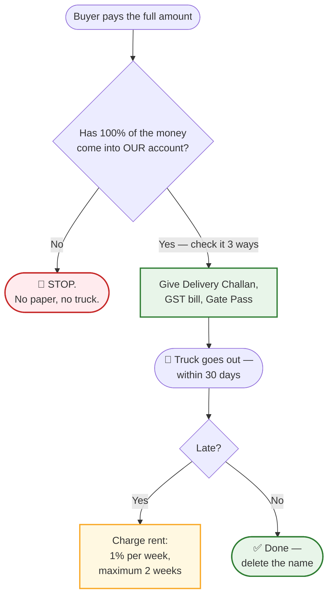

# Scrap Work at the Store
## Learn the whole job in one sitting — for a person who knows nothing

> **For the boss reading this with your new assistant:** read each lesson aloud, then do the practice sums in Lesson 9 together, then run the quiz in Lesson 10. Total time: about an hour. Everything here is written in plain words on purpose.
>
> **Assumptions made in this booklet:**
> 1. You have just joined the **finance section of a Major Store** of MSETCL as an assistant / clerk.
> 2. You have never seen a scrap file. You do not know words like CLARC, ZSC, STA or MSTC.
> 3. Our example store is the **Major Store at Wardha**, in **Amravati Zone**.
> 4. Our example item is an old power transformer we will call **T-1**.
> 5. **All money numbers in this booklet are made up** to make the sums easy. The *method* is real. Real figures will be different.
>
> **When you want the full rules with clause numbers, read** [finance-officer-guide.html](finance-officer-guide.html) **or** [dy-manager-finance-guide.html](dy-manager-finance-guide.html).

---

# Lesson 1 — Ten words you will hear every day

Learn these ten words and half the job is done.

| Word | What it really means | At home you would call it |
|---|---|---|
| **Asset** | Anything costly the company owns — a transformer, a breaker, a computer, a cupboard | Your scooter, your fridge |
| **Asset Register** | The big list where every asset is written with its price and age | The "birth register" of company property |
| **Retire** | To say officially: "this thing is no longer working for us" | Retiring from a job |
| **Scrap** | The old junk left behind after something is retired | Old newspapers, broken chairs |
| **Book value** | What the thing is still **worth on paper** | Resale price written for your old scooter |
| **Reserve Price** | The **lowest** price at which we will sell | The "minimum price" you tell the kabadiwala |
| **STA** | *Subject To Approval* — we may take a little less, **but only if the boss says yes** | "I'll take ₹90, but let me ask my father" |
| **Lot** | A bundle of junk sold as one item | A combo pack |
| **H-1** | The person who offered the **highest** price | The person who bid the biggest number |
| **EMD** | Token advance the buyer pays first — **10%** | Booking amount for a flat |

**The one line to remember:**

> **Nothing is thrown away quietly, and nothing is sold privately. Everything is written, checked, and sold in the open on a government website.**

---

# Lesson 2 — What our company does, and where scrap comes from

**MSETCL carries electricity across Maharashtra.** Think of electricity like traffic:

- Power stations are like factories at the edge of the city.
- The wires to your house are like small lanes.
- **MSETCL is the big highway in between.**

A **sub-station** is like a **bus junction** — power comes in, gets changed, goes out on different routes. The machine that changes the voltage is the **transformer**. Think of it as the **gearbox** of the electricity system.

Now, our network is huge — **51,518 kilometres of lines and 742 sub-stations**. Things get old. When an old transformer is replaced, the old one is left behind. When a breaker burns, it is left behind. Slowly, every sub-station collects a heap of old junk. **That heap is our "scrap", and dealing with it is our job.**

### Why can't we just sell it to the neighbourhood kabadiwala?

Three reasons, and you must be able to say all three:

1. **It is public money.** The junk belongs to the company, not to us. If we sell it quietly, someone will ask where the money went.
2. **Copper is valuable.** Old copper and aluminium attract thieves. Junk lying in a far-away sub-station gets stolen.
3. **Space and safety.** A sub-station full of junk is unsafe and looks neglected.

So the company made one rule for everyone: **write it down, check it, and sell it in the open on the government auction website.**

---

# Lesson 3 — The whole job in six steps

```mermaid
flowchart LR
    A(["1. Old thing<br/>is found"]) --> B["2. Fill the form<br/>+ 3 people inspect"]
    B --> C(["3. Committee says<br/>RETIRED"])
    C --> D["4. Give the thing<br/>to the STORE<br/>+ write in register"]
    D --> E["5. Fix the price,<br/>make the LOT"]
    E --> F(["6. Boss approves"])
    F --> G["7. Online auction<br/>on MSTC website"]
    G --> H["8. Money comes first,<br/>truck goes after"]
    H --> I(["9. Delete the name<br/>from the register"])

    style A fill:#e8f5e9,stroke:#2e7d32,stroke-width:2px
    style C fill:#e8f5e9,stroke:#2e7d32,stroke-width:2px
    style F fill:#fff8e1,stroke:#f9a825,stroke-width:2px
    style G fill:#f3e5f5,stroke:#6a1b9a,stroke-width:2px
    style I fill:#eceff1,stroke:#546e7a,stroke-width:2px
```



Say it like this:

> **Find it → fill the form → retire it → bring it to the store → fix a price → take permission → auction it → take the money → give the material → delete the name.**

That is the whole job. Everything else is detail.

---

# Lesson 4 — The people you will deal with

| Who | What they do | Think of them as |
|---|---|---|
| **Asset Owner** (the engineer at the sub-station) | He has the old thing. He reports it and fills the form | The person whose scooter it was |
| **EE (Store)** | Boss of our store. **After the item comes to the store, he runs the whole file** | The warehouse manager |
| **Dy. Manager (Store)** | Helps EE (Store) in everything | The senior clerk of the store |
| **You and me (Finance)** | We check every **number**: value, price, money | The accountant |
| **CLARC** (Circle committee) | Says "yes, this is retired" | The taluka-level committee |
| **ZSC** (Zone committee) | Says "yes, you may sell it, at this price" | The district-level committee |
| **Competent Authority** | The officer who has the power to say the final yes on **money** | The person who signs the cheque |
| **MSTC** | The government company that runs the **online auction** | Like an online auction website — a government OLX for scrap |
| **The buyer (H-1)** | The dealer who offers the highest price and pays us | The kabadiwala, but registered and online |

**The most useful thing to remember:** once the item and the retirement certificate reach our store, **everything after that is our store's job**. Nobody waits for the sub-station engineer again.

---

# Lesson 5 — The six boxes

Every old thing is put into one of six boxes. The box decides what form we use.

| Box | In simple words | Example from your own house |
|---|---|---|
| **A(a)** | Old, but **still working fine** | A 20-year-old ceiling fan that still runs |
| **A(b)** | Old and **taken out of use** | The fan you removed when you bought a new one |
| **B** | Not broken, but **outdated** — nobody can repair it | An old box TV |
| **C** | **Broken** before its time | A fridge whose compressor is dead |
| **D** | Small junk with **very little** value | Old newspapers, empty bottles, a broken plastic chair |
| **E** | **Worthless** — nobody will pay anything | Rotten wood, wet cardboard, dust and debris |

**Easy way to remember:** A = old, B = outdated, C = broken, D = cheap junk, E = worthless junk.

- Boxes **A, B, C** → report **every three months** (quarterly).
- Box **A(a)** → report **twice a year** (half-yearly), because it is still running.
- Box **E** → no auction at all. We destroy it or throw it away like garbage.

**One rule before anything is retired:** first check whether **some other sub-station in Maharashtra can use it**. Only when nobody can use it, we retire it.

---

# Lesson 6 — The story of T-1

Follow this one transformer from the sub-station to the truck. Every file you will ever handle looks like this.

## Chapter 1 — The engineer reports it

**Baban**, the junior engineer at Wardha sub-station, has an old transformer T-1. It is leaking oil and trips often. Repair would cost more than a new one. Baban writes a **form** saying: "T-1 is finished. Please retire it."

Before he writes it, **three people inspect T-1 together** — the O&M engineer, the **Testing** engineer, and a **Finance** person. Three pairs of eyes, so that nobody declares a good machine dead.

## Chapter 2 — The committee retires it

The form goes to **CLARC**, the circle committee. They check the test reports and the papers. They say: **"T-1 is retired."** They give a **Retirement Certificate** — T-1's retirement letter.

## Chapter 3 — It comes to our store

Baban sends **the transformer and the certificate to our EE (Store)**. Our store:

- takes the item in,
- writes it in **one register** (one register for the whole zone — not loose papers),
- keeps it safe with **a guard and CCTV** if needed.

**From this moment, the file is ours.** That is where you and I come in.

## Chapter 4 — What is it worth on paper? (Book value)

Now the first **finance** question: what is T-1 worth **in our accounts**?

Look at your own scooter. You bought it for ₹60,000 ten years ago. Every year it loses value — that loss is called **depreciation**. Today, on paper, it may be worth only ₹5,000. That ₹5,000 is its **book value**.

Same for T-1. Suppose:

| | Amount |
|---|---|
| Bought for (original cost) | ₹2,00,00,000 |
| Value lost over the years (depreciation) | ₹1,90,00,000 |
| **Worth on paper today (book value)** | **₹10,00,000** |

**Your job:** open the Asset Register, find T-1 by its **code number** (never by name alone — names get mixed up), and write these three figures. Then check the arithmetic yourself.

**Watch out for this:** sometimes an item is fully written off and shows **zero**. But it is still standing there, and someone will pay us for it. If you see zero on something valuable, **tell me immediately** — that is a mistake waiting to happen.

## Chapter 5 — What is it worth in the market? (Reserve Price)

Book value is what the *accounts* say. But the buyer pays for **metal**, not for our accounts. So now we fix the **Reserve Price** — the lowest price we will accept.

Suppose T-1 contains:

| Material | How much | Market rate | Value |
|---|---|---|---|
| Copper | 2,000 kg | ₹600 per kg | ₹12,00,000 |
| Steel | 8,000 kg | ₹30 per kg | ₹2,40,000 |
| Aluminium | 1,000 kg | ₹150 per kg | ₹1,50,000 |
| **Total** | | | **₹15,90,000** |

The buyer must cut it, load it and carry it from a far-away sub-station. So we keep the Reserve Price a little lower — say **₹15,00,000** — to attract bidders.

**Two rules you must never forget:**
1. Take the rate from the **MSTC website**, and **print it with today's date**. Never accept a rate somebody tells you over the phone.
2. Do this **within 7 days**.

**Your job:** recompute every multiplication on a calculator or in Excel. Check the unit — if the rate is per **kg**, the quantity must be in **kg**, not in tonnes. This one mistake happens more often than you think.

## Chapter 6 — The discount permission (STA)

Now suppose the auction happens and the highest offer is only **₹14,20,000**. That is below our ₹15,00,000. Do we throw the offer away?

No — we keep a **cushion**. Before the auction we decide: *"We will go down to a certain level, but only with the boss's permission."* That cushion is called **STA — Subject To Approval**.

It works like this. Imagine you are selling your old bicycle and you tell your father:

> "My price is ₹100. But if someone offers ₹90, I won't refuse — I will ask you first."

That "₹90" is your STA level. Simple.

The policy's own example: if the Reserve Price is **₹50,000** and we allow **10%** STA, then any offer **₹45,000 or above** stays alive — it does not get thrown away; it goes to the boss for a decision.

For T-1: Reserve Price ₹15,00,000 with 10% STA → **floor = ₹13,50,000**.

- Offer of ₹15,20,000 → **Sold** at once.
- Offer of ₹14,20,000 → between ₹13,50,000 and ₹15,00,000 → goes to **STA** — the boss decides within 7 working days.
- Offer of ₹13,00,000 → **below the floor → rejected**. We try again with a lower price.

**Your job:** compute this floor yourself every single time. `Floor = Reserve Price × (100% − STA%)`. If this sum is wrong, we either lose a genuine buyer or we sell too cheap.

## Chapter 7 — Auction day

Our store sends the list of "lots" to **MSTC**. A **lot** is a bundle — for example, "Lot No. 3: Wardha mixed scrap — T-1 plus three old breakers".

MSTC puts it on their website. Dealers come and **see the material with their own eyes** — we must let them in and note their names and phone numbers. Then bidding opens online for **4 hours**. If someone bids in the last 8 minutes, the time extends by 8 minutes. The highest bidder is **H-1**. Nobody's name is shown, only the amount.

**One very important rule:** the Reserve Price and the STA percentage are **secret**. They are typed into the MSTC website — **by EE (Store), not by us**. Our job is to take a **screenshot** and check that what is typed is exactly what the boss approved. You never type those numbers yourself. If you did, you could not check them.

## Chapter 8 — The money comes first, the truck goes after

This is the rule I will never let you break.



The buyer pays in two parts:

1. **10% advance (EMD)** — within **7 days**. For a ₹15,00,000 deal that is ₹1,50,000.
2. **The rest** — within **15 days** if the deal is below ₹50 lakh; within **40 days** if it is ₹50 lakh or more.

**Your job — the three-way check.** Before any paper is given, match these three:

| | Amount |
|---|---|
| What MSTC says it sent us | ₹15,00,000 |
| What our **bank** shows as received | ₹15,00,000 |
| What the **Sale Order** says | ₹15,00,000 |

All three must be **exactly equal**. Only then we give the Delivery Challan, the GST bill and the Gate Pass. **If a truck driver argues, you do not argue back — you call me.**

Then: the buyer has **30 days** to take the material. If he is late, we charge **rent: 1% of the value for every week, up to two weeks only**.

## Chapter 9 — Deleting the name

After the material goes out, we remove T-1 from the Asset Register — like striking a retired employee's name from the muster roll. This is called **de-capitalisation**.

We also note the profit or loss:

| | Amount |
|---|---|
| We sold T-1 for | ₹15,00,000 |
| It was worth on paper | ₹10,00,000 |
| **Profit** | **₹5,00,000** |

And we tell the division: "T-1 is gone — please remove it from your books too."

**Then the file is closed. That is the whole story, start to finish.**

---

# Lesson 7 — What I will ask you to do every day

1. **Write in the register.** Every item that comes in, with its date, code, and value.
2. **Open the Asset Register** and find the value of each item. By **code**, not by name.
3. **Take the MSTC rate printout** whenever a price is being fixed — with the date on it.
4. **Do the multiplication again**, even if someone else has done it.
5. **Compute the STA floor** and write it on the file.
6. **Take the screenshot** of the MSTC portal and check it against the approval letter.
7. **Match the money three ways** when payment comes.
8. **Note the dates** — 7 days, 15/40 days, 30 days, 2 days. Put reminders in your diary.
9. **Keep the file tidy**, page by page, so that anyone can read it two years later.
10. **Write the source next to every number.** Example: *"rate from MSTC printout dated 12.09"*, *"value from ledger page 47"*.

**The golden habit:** *a number without a source is a guess. We do not sign guesses.*

---

# Lesson 8 — Four things you must NEVER do

| # | Never… | Because |
|---|---|---|
| 1 | **Never let the truck go before the money comes** | If the material leaves unpaid, the loss is ours |
| 2 | **Never type the Reserve Price or STA into the website** | That is EE (Store)'s job and the number is secret. We only **check** it |
| 3 | **Never write a value from memory or "approximately"** | Open the register, or the MSTC site. Always |
| 4 | **Never mix items that are in the register with items that are not** | Later we will not be able to delete the names properly. Keep them in separate bundles |

**And one more:** if you are not sure — **ask me**. Asking takes two minutes. A wrong number can take two years to undo.

---

# Lesson 9 — Practice time (do these with me)

Take a pencil. Answers are at the end of this lesson.

### Sum 1 — Book value

A machine was bought for **₹10,00,000**. Depreciation charged so far is **₹9,00,000**.
**Question:** What is its book value?

### Sum 2 — Reserve Price

Copper: **500 kg** at **₹600 per kg**. Iron: **200 kg** at **₹30 per kg**.
**Question:** What is the total? If we keep the Reserve Price at a round figure just below the total, what would you suggest?

### Sum 3 — STA floor

Reserve Price is **₹3,00,000**. We allow **10%** STA.
**Question:** What is the floor?

### Sum 4 — What happens to the bid?

Reserve Price **₹3,00,000**, floor **₹2,70,000**. For each offer, say **Sold**, **STA** or **Rejected**:

| Offer | Your answer |
|---|---|
| (a) ₹3,10,000 | |
| (b) ₹2,80,000 | |
| (c) ₹2,50,000 | |

### Sum 5 — Late lifting

Delivery Order dated **1 September**. Material value **₹3,00,000**. The buyer lifts it on **20 September**.
**Question:** How many weeks late? How much rent do we charge (1% per week, maximum two weeks)?

### ✅ Answers

| Sum | Answer | How |
|---|---|---|
| 1 | **₹1,00,000** | 10,00,000 − 9,00,000 |
| 2 | Copper 500 × 600 = ₹3,00,000; Iron 200 × 30 = ₹6,000; total **₹3,06,000**. Suggest Reserve Price **₹3,00,000** | Quantity × rate |
| 3 | **₹2,70,000** | 3,00,000 × (100% − 10%) = 3,00,000 × 90% |
| 4 | (a) **Sold** — above the Reserve Price · (b) **STA** — between floor and RP, boss decides · (c) **Rejected** — below the floor | Compare with RP and floor |
| 5 | 19 days late = 3 weeks, but the **maximum is 2 weeks** → 2% of ₹3,00,000 = **₹6,000** | 1% per week, capped at 2 weeks |

---

# Lesson 10 — Quiz (10 questions)

Write your answers, then check them.

1. What do we call the price below which we will not sell? ____________
2. What does **STA** stand for? ____________
3. Fill the blank: money comes ____________, truck goes ____________.
4. The buyer pays 10% advance within how many days? ____________
5. If the deal is below ₹50 lakh, the balance must come within how many days? ____________
6. Who types the Reserve Price into the MSTC website? ____________
7. If an item is not in the Asset Register, should you write zero? Yes / No
8. Box **E** items are sold by auction. True or False?
9. The buyer must lift the material within how many days of the Delivery Order? ____________
10. If the numbers don't match and someone is pressuring you — what do you do? ____________

### ✅ Answers

1. **Reserve Price**
2. **Subject To Approval**
3. **first … after**
4. **7 days**
5. **15 days** (40 days if ₹50 lakh or more)
6. **EE (Store)** — we only check it
7. **No** — prepare a rough value and get it approved
8. **False** — Category E is destroyed or thrown away; no auction
9. **30 days** (then rent of 1% per week, up to two weeks)
10. **Write your note on the file and tell me** — never sign quietly

---

# Lesson 11 — Your first week

| Day | Do this |
|---|---|
| **Day 1** | Sit with the store register. Read the last 20 entries. Ask the meaning of every column |
| **Day 2** | Open the Asset Register. Learn how to find one item by its **code** |
| **Day 3** | Take one old file and read it from page 1 to the last page — form, certificate, list, price, auction, money |
| **Day 4** | Open the MSTC website with the store team. See a live catalogue. Take a rate printout |
| **Day 5** | Do the five practice sums again, alone |
| **Day 6** | Sit with the gate. Watch one truck go out. See the challan, the bill and the gate pass |
| **Day 7** | Tell me the whole story of T-1 in your own words. If you can, you are ready |

---

# Lesson 12 — One-page summary (pin this above your desk)

```
╔════════════════════════════════════════════════════════════════════════════╗
║                   SCRAP WORK — NINE STEPS, ONE LINE EACH                   ║
╠════════════════════════════════════════════════════════════════════════════╣
║  1. FIND IT     → old / broken / outdated / extra? → put in box A–E        ║
║  2. FILL FORM   → engineer reports + 3 people inspect                      ║
║  3. RETIRE IT   → committee says "RETIRED" + gives certificate             ║
║  4. BRING IT IN → item + certificate come to OUR store, in the register    ║
║  5. VALUE IT    → book value from the Asset Register (by CODE)             ║
║  6. PRICE IT    → reserve price from MSTC printout (dated!) in 7 days      ║
║  7. TAKE OK     → boss approves price + STA discount                       ║
║  8. AUCTION IT  → MSTC website, 4 hours, highest bidder = H-1              ║
║  9. MONEY FIRST → 10% in 7 days, rest in 15/40 days, THEN truck            ║
║ 10. DELETE NAME → remove from register, note profit or loss                ║
╠════════════════════════════════════════════════════════════════════════════╣
║  NEVER FORGET:                                                             ║
║  • NO money = NO truck.                                                    ║
║  • I never TYPE the reserve price — I only CHECK it.                       ║
║  • Rate from the MSTC printout, with the DATE. Never from memory.          ║
║  • Write the source beside every number.                                   ║
║  • Not sure? ASK. Two minutes now saves two years later.                   ║
╚════════════════════════════════════════════════════════════════════════════╝
```

---

# Last page — glossary in one line each

| Word | One line |
|---|---|
| **Asset Register** | The list where every company item is written with its price |
| **Book value** | Original cost minus all the value it has lost |
| **CLARC** | The circle committee that retires an item |
| **De-capitalisation** | Deleting the name from the Asset Register after sale |
| **Delivery Order** | The paper that allows the buyer to take the material |
| **Depreciation** | The value an item loses every year because of age |
| **EMD** | The 10% token advance the buyer pays first |
| **H-1** | The highest bidder |
| **Lot** | A bundle of scrap sold as one |
| **MSTC** | The government company that runs our online auction |
| **Reserve Price** | The lowest price we will accept |
| **Retirement** | The official "this item is finished" declaration |
| **STA** | The pre-decided discount we may accept with the boss's permission |
| **ZSC** | The zone committee that approves the sale and recommends the price |

---

> **A last word from me to you.** Nobody is born knowing this work. The only thing I ask from you is this: **never write a number you have not seen with your own eyes.** Open the register. Take the printout. Do the multiplication. Match the money. Write the source. Do these five things every single day and you will never get into trouble, and neither will I.
